<!--
Search keywords (kept here so GitHub search, Google and AI assistants can find the project):
OmniGet is a free open source downloader, media toolbox and AI agents desktop app for Windows, macOS and Linux.
As a downloader it is a udemy downloader, hotmart downloader, kiwify downloader and course downloader for
purchased courses and offline viewing, a youtube downloader and yt-dlp gui with playlist and batch downloads
in 4K and no command line, an instagram downloader (stories, reels, highlights), twitter and x video downloader,
pinterest downloader and board backup, tiktok downloader, reddit downloader, twitch vod downloader, bilibili
downloader, telegram downloader, torrent client and magnet downloader, subtitle downloader, media downloader
and download manager. As a toolbox it does whisper transcription, text to speech, epub and pdf reading, anki
flashcards with spaced repetition, a music player, pdf tools, pdf to markdown, image and video compression,
video to gif, ffmpeg gui conversions and ctf tools.
As an agents app it is a gui for claude code, a codex gui and a gemini cli gui: a cross-platform desktop app
to run ai coding agents, multi-agent and parallel agents, an agent client protocol (acp) client, local llm
agents with ollama and lm studio, run claude code in a loop until tests pass, scheduled and durable agent jobs,
cron and webhook triggers, permissions with diff review, undo checkpoints, a built-in mcp server and mcp client,
a claude code plugin, and an isometric world of generative agents. Built with tauri, rust and svelte.

GitHub allows 20 topics. The repository uses exactly these 20:
downloader, download-manager, media-downloader, video-downloader, youtube-downloader, yt-dlp,
yt-dlp-gui, course-downloader, udemy-downloader, hotmart-downloader, instagram-downloader,
tiktok-downloader, ai-agents, claude-code, codex-cli, coding-agent, agent-client-protocol,
mcp-server, ollama, local-llm
-->

<p align="center">
  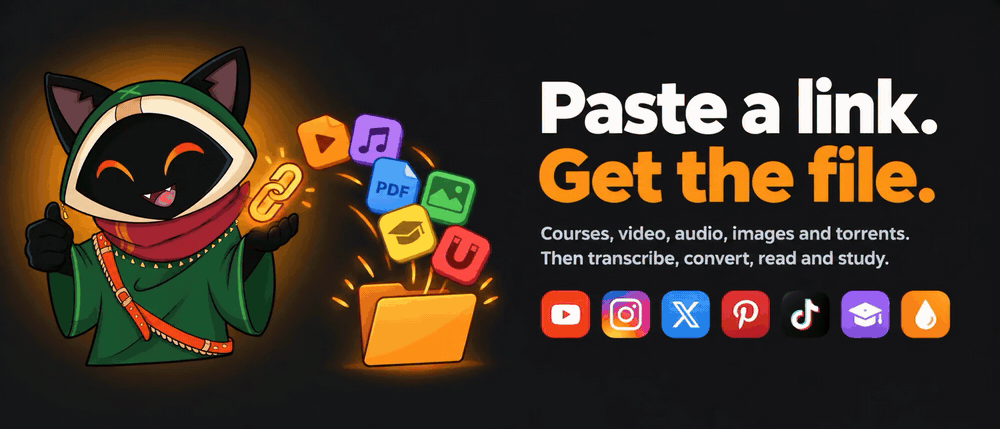
</p>

<h1 align="center">OmniGet</h1>

<p align="center">
  <b>English</b>
  · <a href="README_pt_br.md">Português (BR)</a>
  · <a href="README.ru.md">Русский</a>
  · <a href="README_zh_CN.md">简体中文</a>
</p>

<p align="center">
  <b>A yt-dlp GUI, a Udemy and Hotmart course downloader, and a desktop app for AI coding agents.<br/>Free and open source for Windows, macOS and Linux. No terminal.</b>
</p>

<p align="center">
  Download YouTube, Instagram, TikTok, X, Pinterest and 1,800+ other sites, then transcribe, convert, read and study what you saved.<br/>Run Claude Code, Codex, Gemini CLI and local Ollama models as agents with permissions, undo, jobs and loops, and watch them work in a house you can visit.
</p>

<p align="center">
  <a href="https://github.com/tonhowtf/omniget/releases/latest"></a>
  <a href="https://github.com/tonhowtf/omniget/releases"></a>
  <a href="https://github.com/tonhowtf/omniget/stargazers"></a>
  <a href="LICENSE"></a>
  <a href="https://discord.gg/jgdxyPy7Vn"></a>
  <a href="https://hosted.weblate.org/engage/omniget/"></a>
</p>

<p align="center">
  <a href="#download-and-install"></a>
  &nbsp;
  <a href="#agents-and-the-world"></a>
  &nbsp;
  <a href="#the-tools-section-156-tools-in-24-categories"></a>
</p>

<p align="center">
  <sub>Free. Open source under GPL-3.0. No account, no ads, no telemetry on what you download. Your files stay on your computer.</sub><br/>
  <sub>13,800+ GitHub stars. The most starred repository in the <a href="https://github.com/topics/udemy-downloader">udemy-downloader</a>, <a href="https://github.com/topics/hotmart-downloader">hotmart-downloader</a>, <a href="https://github.com/topics/course-downloader">course-downloader</a>, <a href="https://github.com/topics/yt-dlp-gui">yt-dlp-gui</a>, <a href="https://github.com/topics/media-downloader">media-downloader</a> and <a href="https://github.com/topics/instagram-downloader">instagram-downloader</a> topics.</sub>
</p>

<p align="center">
  
</p>

---

## Contents

- [**AI agents and the World**: Claude Code, Codex, Gemini CLI, Ollama, jobs, loops, MCP, the house and visits](#agents-and-the-world)
- [Why OmniGet](#why-omniget)
- [Download and install](#download-and-install)
- [Your first download in one minute](#your-first-download-in-one-minute)
- [What OmniGet downloads: Udemy, Hotmart, YouTube, Instagram, TikTok, X and 1,800+ sites](#what-omniget-downloads)
- [The browser extension, step by step](#the-browser-extension-step-by-step)
- [The Tools section: 156 tools in 24 categories](#the-tools-section-156-tools-in-24-categories)
- [MCP server for Claude Code, Cursor and VS Code, and a Claude Code plugin](#omniget-for-ai-agents-mcp-server-and-claude-code-plugin)
- [Plugins: Courses, Study, Telegram, Convert](#plugins-courses-study-telegram-convert)
- [For League of Legends players](#for-league-of-legends-players)
- [Everything else in the box](#everything-else-in-the-box)
- [Privacy and what OmniGet refuses to do](#privacy-and-what-omniget-refuses-to-do)
- [Frequently asked questions](#frequently-asked-questions)
- [Command line](#command-line)
- [Build from source](#build-from-source)
- [Contributing and translations](#contributing-and-translations)
- [Standing on open source](#standing-on-open-source)

---

<a id="agents-and-the-world"></a>

## AI agents on your desktop: Claude Code, Codex, Gemini CLI and Ollama

<p align="center">
  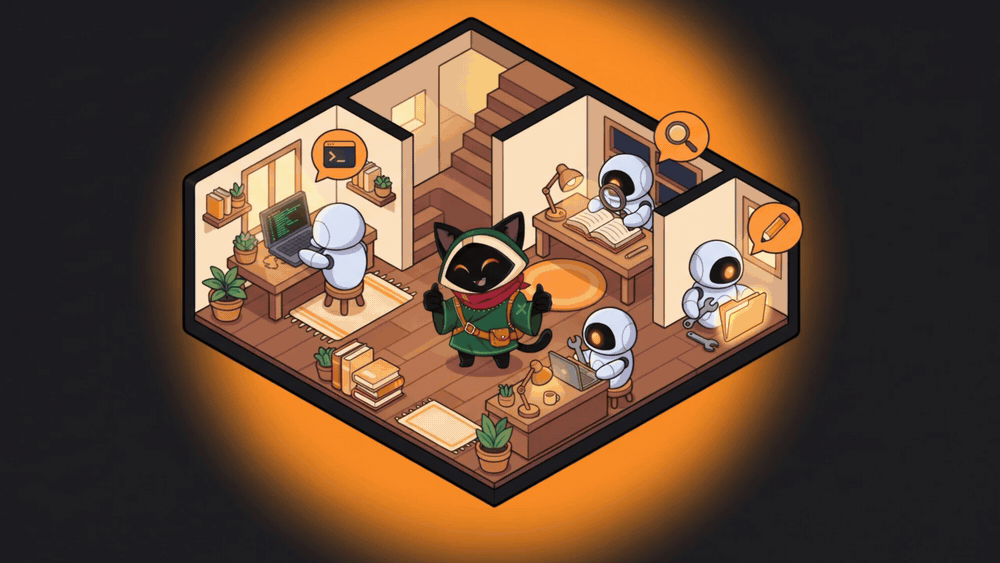
</p>

Claude Code, run through OmniGet, fixes a failing test in about 15 seconds from one command. It asks permission with the diff on screen, and one click takes the whole turn back. New in 0.10 and now the centre of the app, OmniGet is a desktop app for AI coding agents. It carries the whole system that goes around an agent: a coding harness with permissions and undo, a durable job queue with loops and triggers, a roster that takes your local models, your API keys and the agent CLIs you already pay for, a project memory, and a small world where those agents live and where you can watch them work. It runs on your machine. Nothing talks to the network until you add a key, start a local model or open your house.

| You want to | Open | What happens |
| --- | --- | --- |
| Have an agent change code in a folder | **LLM → Chat** | It reads, edits and runs commands inside that folder only, asks before it writes, and one click undoes the turn |
| Leave work running | **LLM → Jobs**, **Loops** | The turn survives closing the window and a crash; a Loop repeats until your check command passes |
| Start work on a schedule or from another program | **LLM → Jobs → Triggers** | A cron line or a webhook on the local bridge starts a job |
| A GUI for Claude Code, Codex or Gemini CLI | **LLM → Accounts** | They join the roster as agents, keep their login, ask permission through OmniGet |
| Agents on a local model, offline | **LLM → Models** | Ollama, LM Studio or llama-server runs the same tools with no key |
| Several agents in parallel | **LLM → Jobs**, **World** | Two jobs run at once, agents delegate to each other, each at its own workbench |
| See who is doing what | **World** | Each agent walks to its own workbench, shows the tool in a balloon and waves when it needs you |
| Show a friend | **World → Open the house** | A code, a visit, a chat. Your app stays the authority |

<a id="talk-and-code-llm-in-the-sidebar"></a>

### A coding agent with permissions, a sandbox and undo

<p align="center">
  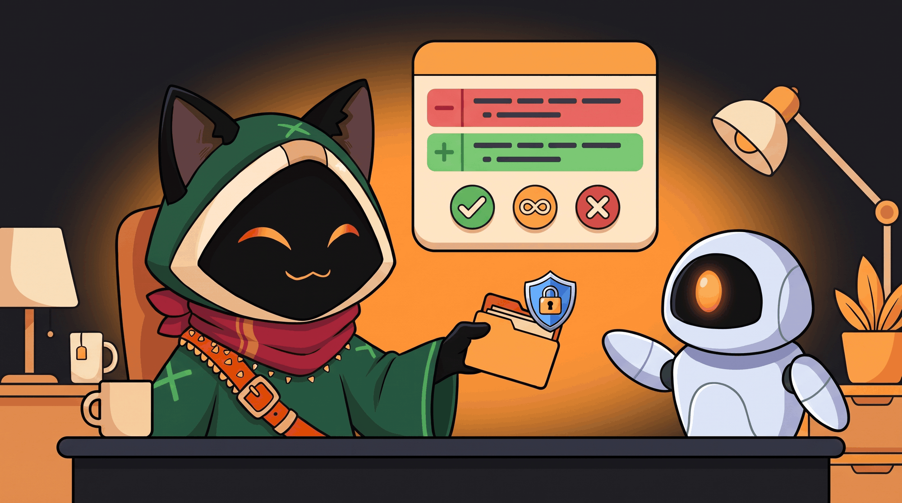
</p>

Pick an agent, attach a folder, ask for a change.

- **Eleven tools, one folder.** `fs_read`, `fs_list`, `fs_glob`, `fs_grep`, `fs_edit`, `fs_write`, `fs_apply_patch`, `shell_exec`, `todo_write`, plus `kb_search` and `kb_write`. Every path is resolved inside the folder you attached; a path outside it becomes its own question (`external_directory`) and the answer covers that one call. Each conversation has its own folder.
- **Edits that survive a sloppy model.** `fs_edit` falls back from an exact match to a block match anchored on the first and last line, and refuses when the block it found is out of proportion to what was asked. `fs_apply_patch` takes the V4A envelope with a context fuzz ladder and keeps the file's own context lines. A small model that invents a container path such as `/workspace` is put back at the folder root instead of failing.
- **A sandboxed shell.** On macOS `shell_exec` runs under seatbelt: no network, writes only inside the folder. The chip next to the folder always shows whether the sandbox is on.
- **Permission with the evidence on screen.** Anything that writes asks first and shows the command or the diff. **Allow** is once, **Deny** is once, **Always** stores a rule for that agent by command prefix: `git status *`, `npm run test *`, `node *`. A chained line (`git status && rm -rf x`) needs a rule for every segment, and `$(…)`, backticks and `>` never ride on a rule. The rules are listed in the inspector on the right, where you edit the pattern, switch a rule to ask or deny, or delete it; the next call asks again.
- **Undo takes the whole turn back.** Before the first write of a turn OmniGet takes a checkpoint: it snapshots the folder into a shadow git that never touches your repository. **Undo** restores the files and removes that turn's messages from the conversation, without running anything again. It also covers edits made by Claude Code or an ACP agent. When a turn ran shell commands, the toast names each one, so you know exactly what the turn touched.
- **Stop means stop.** Cancelling a turn also drops its pending permission request, in the chat and in the job list.
- **Models.** A local server ([Ollama](https://github.com/ollama/ollama), [LM Studio](https://lmstudio.ai), llama-server) or your own keys, with a router that walks down a chain when a quota runs out or a provider rate-limits. A fresh install is local first.

Measured on the demo project (one failing test, a one-character bug), release build, Apple Silicon: Claude Code through OmniGet fixes it in about 15 seconds from one command; an 8B local model (`qwen3:8b` on Ollama) does the same in about 3 minutes, asking permission with the diff.

### Local AI agents with Ollama, LM Studio and llama-server

A fresh install is local first. Point OmniGet at Ollama, LM Studio or llama-server and the agents run on your machine, offline, with the same eleven tools, the same permission prompts and the same undo. On the demo project an 8B model (`qwen3:8b` on Ollama) finds and fixes the bug in about 3 minutes. Add API keys later and the router uses them as the next step of the chain; the local model stays first for as long as you want.

<a id="leave-it-working-jobs-loops-and-triggers"></a>

### Loop an AI agent until the tests pass: Jobs, Loops, cron and webhooks

<p align="center">
  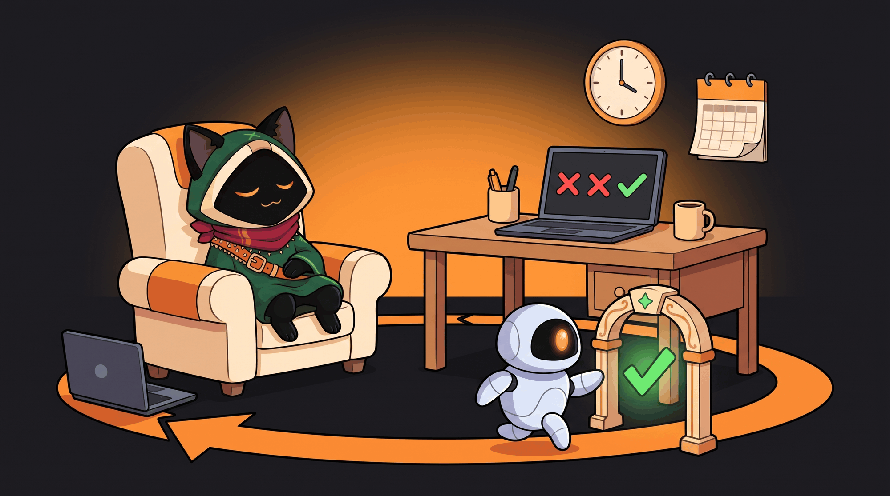
</p>

- **A job is an agent turn that outlives the window.** It lives in a SQLite queue with its state (`queued`, `running`, `waiting_approval`, `done`, `failed`, `cancelled`), its log, and what it cost: model, tokens in and out, cache reads, and the cost when the provider reports one. Two jobs run at a time. A job that needs a permission shows **Allow / Always allow / Deny** right on its row.
- **A Loop repeats rounds until a check passes.** Give it a prompt and a check command (`npm test`, `cargo test`, `node test/cart.test.js`); the check runs under the same sandbox, and the Loop ends with `check_passed`, or when the rounds or minutes you set run out.
- **It keeps going without you.** Close the window and the app stays in the tray with the Loop running. Kill the process mid-round and the next launch marks that round failed and opens a new one by itself. Both were tested exactly that way. An unattended Loop needs the rules it will use (an unanswered request is denied after two minutes).
- **Triggers.** A five-field cron line (lists, ranges, steps, `@hourly`, `@daily`, local time), checked once a minute with no duplicate fire, or a webhook: `POST /v1/hooks/<id>` on the local bridge with your token, where the body becomes `{{body}}` in the prompt.
- **From a terminal**, against the running app:

```bash
omniget agent run "Fix the failing test in src/cart.js" --agent claude-code --workspace .
omniget agent loop "Make the tests pass" --agent omni --workspace . --check "npm test" --rounds 5
omniget agent jobs          # list, show one, --cancel
omniget agent loops
omniget agent agents
```

<p align="center">
  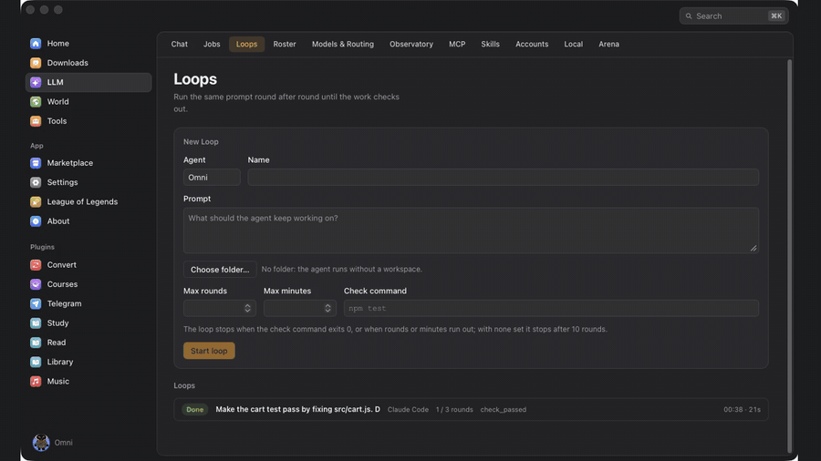
</p>

<a id="bring-your-own-agents-and-let-them-work-as-a-team"></a>

### A GUI for Claude Code, Codex and Gemini CLI: run them as agents that work as a team

<p align="center">
  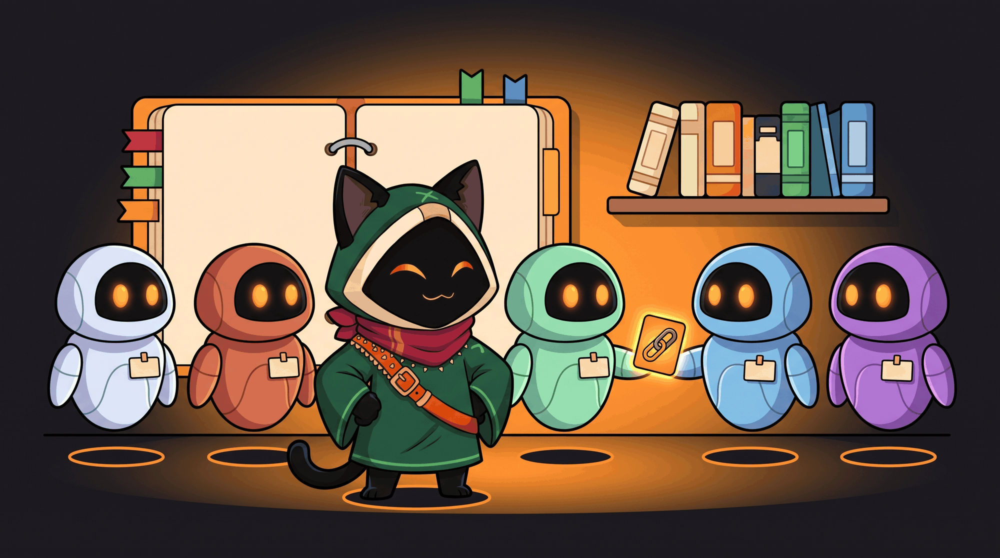
</p>

- **Claude Code and Codex accounts** plug in with their quota on screen, including the login your terminal already has. Several accounts of the same CLI can coexist, read-only or allowed to write.
- **OmniGet is an [Agent Client Protocol](https://agentclientprotocol.com) client.** Any CLI that speaks ACP joins the roster from **LLM → Accounts**: [Gemini CLI](https://github.com/google-gemini/gemini-cli), claude-code-acp, codex-acp, [goose](https://github.com/aaif-goose/goose), [opencode](https://github.com/anomalyco/opencode), or a command you type. OmniGet is agent-agnostic: it has its own JSON-RPC client over stdio, so there is no SDK to install; the agent keeps its login and model, and its permission requests show up in OmniGet's prompt. Checked field by field against claude-code-acp 0.16.
- **Multi-agent with `agent_delegate`.** One agent hands a task to another and gets the answer back as a tool result, in a child conversation you can open. A local coordinator that delegates the hard part to Claude Code costs exactly one run of the CLI.
- **A memory the whole team shares.** `AGENTS.md` (or `CLAUDE.md`) plus markdown notes in `.omniget/kb/`, inside your project, in git if you want. The index goes into every prompt, and the agents search and write notes with `kb_search` and `kb_write`.
- **Skills** install from a folder, a zip, or `owner/repo` and `owner/repo@skill` as in `npx skills add`, and pass through a scanner first.
- **MCP both ways.** External MCP servers become tools, granted per agent as *auto*, *ask* or *deny*. And OmniGet serves its own 49 tools, the coding ones included, to Claude Code, Cursor, VS Code and the rest: see [OmniGet for AI agents](#omniget-for-ai-agents-mcp-server-and-claude-code-plugin).
- **Context pruning, off by default.** On long conversations a judge decides which old tool outputs no longer bear on the task and replaces them with a marker; the call and its id stay, so the agent can run the tool again. It works inside a long turn as well as between turns, and on Claude Code conversations too. The local judge (MiniLM, on your machine) only ever omits an output; the optional remote judge needs a key and says plainly that previews leave your computer. Every request leaves a receipt with measured numbers: outputs omitted, estimated tokens before and after, input tokens the provider billed. No invented percentages.
- **Budgets.** Per agent: dollars per day, tokens per turn, tool calls per turn. A spent agent goes to sit down, literally.

<a id="the-world-watch-them-work"></a>

### The World: watch your AI agents work in an isometric house

<p align="center">
  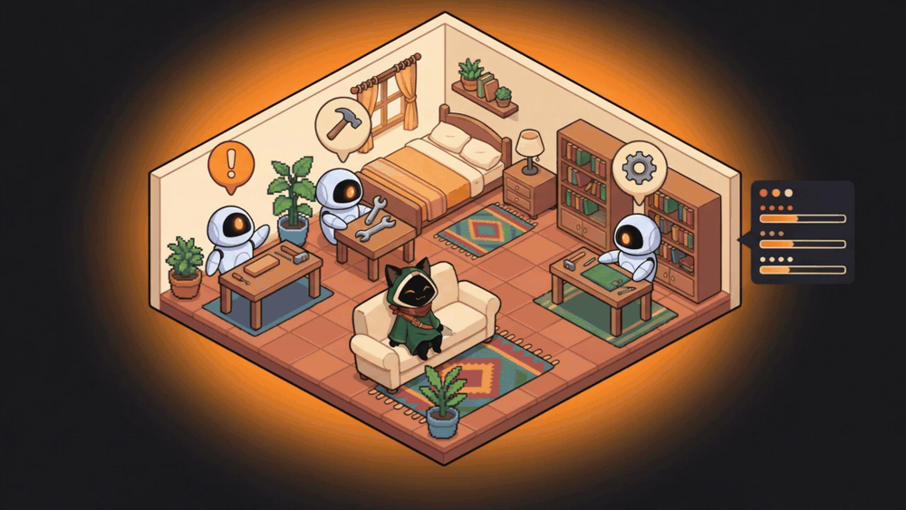
</p>

A house is made on your first visit and the agents of your roster move in, CLI and ACP agents included. A fresh install starts with three: **Omni** (coordinator), **Builder** (code) and **Scout** (reading and research), all editable. Add or remove an agent and the house follows.

- **One post per agent.** Each has its own desk and workbench, so two agents working at once never stand on the same tile. It walks to the desk when a turn starts and to the workbench when a tool runs, with a balloon naming the tool (`fs_edit cart.js`, `shell_exec`). When it needs your permission it stops and waves at you. When its budget is spent it sits down, tired. Jobs and Loops move the agents exactly like chat does.
- **The Activity panel** next to the house has a row per agent: state, current tool, running job, energy. Click a row and the camera goes to that agent.
- **Energy is quota.** What is left of an account's window is that agent's energy; an exhausted account goes to bed.
- **Demo mode.** `/world?demo=1`, or the **Demo** button, plays a scripted run with three agents and a permission request without spending a token. It is what the clip below shows.
- **Built here.** The simulation is a Rust crate, the renderer is WebGL2, and the app measures your machine once and picks a quality tier. With eight agents working at once it held a median of 64 frames per second on the test machine (debug build). Furniture goes in slots. A hand-crafted yard with four outdoor workbenches is one click away (**World → Quintal artesanal**). Agents only think through a model if you switch that on.

<p align="center">
  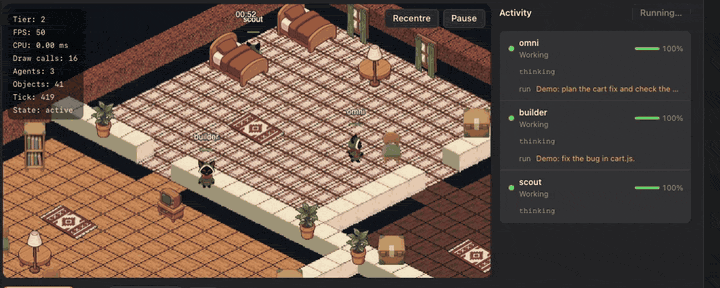
</p>

### Visits: open your house to a friend with a code

<p align="center">
  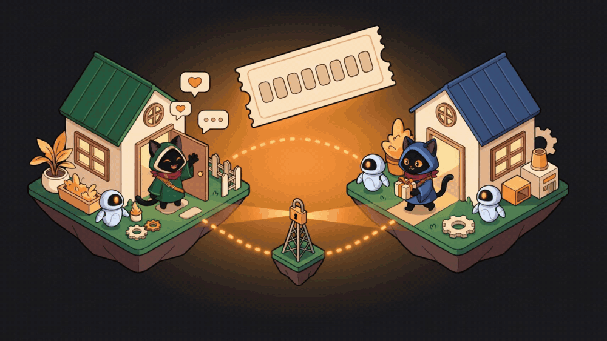
</p>

**Open the house** gives you a code such as `ZZCJ-YA09`. A friend types it and walks into your house: they see your map, your agents at work and the other guests, walk around, and what they say shows up as a balloon.

- **Your app is the authority.** The room server only relays frames. Your keys, your quota and your agents' brains never leave your machine, and a visitor can do one thing: walk.
- **No accounts.** The hello is signed with the ed25519 key of your local profile.
- **It keeps serving while you work.** With the house open the world stays awake when the window is covered or you are on another tab, and a guest that misses a frame asks for a fresh picture instead of freezing.
- **Closing the house closes the only socket there is.**
- **The public relay** is `wss://chat.tonho.wtf/v1/room`. To host your own, `omniworld-server` is a single binary with a `Dockerfile` and a `docker-compose.yml` in `scripts/omniworld-server/`; put it behind a proxy that terminates TLS and set the address in **Settings → World → Room server**.

**The pet.** A floating Omni reacts to what the agents do, including Claude Code or Codex running in a terminal outside the app, and answers permission prompts with Allow, Always or Deny.

**The limits strip.** A thin strip on a screen edge with one ring per coding assistant: how much of each usage limit is gone, when it resets, and whether the assistant is working, waiting or done. Off until you switch it on in **LLM → Accounts**, and every assistant is its own checkbox that says what it reads. A reader opens only the login that tool already keeps on your machine, read-only, asks that tool's own service for your usage at most once every five minutes, and never writes, refreshes or logs a token. Local runtimes (Ollama, LM Studio) show the models they have loaded. Claude Code is verified; the other remote readers are marked *beta*.

---

<a id="why-omniget"></a>

## Why OmniGet: a course downloader, a yt-dlp GUI and a media toolbox in one app

You bought a course and want it on your disk before the platform pulls it. You keep a yt-dlp cheat sheet because the flags never stick. You have one site for Instagram stories, another for X videos, a Chrome extension for Pinterest, a Python script for subtitles, and none of them remember your login.

OmniGet puts all of that behind one text box. Paste a link, see a preview with quality options, click download. The same window then plays the course, reads the PDF, transcribes the audio and backs up the Pinterest board. yt-dlp and FFmpeg install themselves and stay updated, so there is nothing to configure and no terminal to open.

<p align="center">
  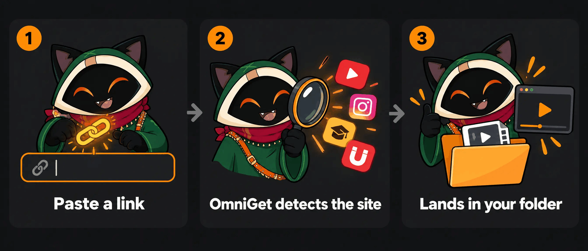
</p>

### How it compares

| | OmniGet | yt-dlp alone | Single-site web downloaders | Paid course downloaders |
|---|---|---|---|---|
| Sites | Courses, Instagram, X, Pinterest, Bilibili, Telegram, torrents natively, plus 1,800+ through yt-dlp | 1,800+ | One | One or two platforms |
| Setup | Download one file, open it | Python, PATH, FFmpeg, flags | None | Installer, license key |
| Logged-in content | Cookies from your browser through the extension | Manual `--cookies` export | Rarely | Sometimes |
| Queue | Resume, retry with backoff, rules, followed channels | One command at a time | No | Varies |
| After the download | Player, reader, flashcards, notes, 156 tools | Files | Files, often re-encoded | Files |
| Price and license | Free, GPL-3.0 | Free, Unlicense | Free with ads | Subscription |

yt-dlp is the engine OmniGet runs on, and OmniGet would not exist without it.

---

## Download and install

Pick your system. Every build is published on the [Releases page](https://github.com/tonhowtf/omniget/releases/latest). Updates arrive inside the app.

<table>
  <tr>
    <th align="left">System</th>
    <th align="left">What to download</th>
    <th align="left">Other ways</th>
  </tr>
  <tr>
    <td><b>Windows 10 / 11</b></td>
    <td><code>omniget_x.y.z_x64-setup.exe</code> (installer)<br/><code>omniget_x.y.z_x64-portable.exe</code> (no install, runs from anywhere)<br/><code>omniget_x.y.z_x64_en-US.msi</code> (for IT deployments)</td>
    <td><code>winget install -e --id tonhowtf.OmniGet</code></td>
  </tr>
  <tr>
    <td><b>macOS 10.15+</b></td>
    <td><code>omniget_x.y.z_aarch64.dmg</code> for Apple Silicon (M1 and later)<br/><code>omniget_x.y.z_x64.dmg</code> for Intel Macs</td>
    <td><code>brew install --cask tonhowtf/tap/omniget</code></td>
  </tr>
  <tr>
    <td><b>Linux</b></td>
    <td><code>.deb</code> for Debian and Ubuntu (amd64 and arm64)<br/><code>.rpm</code> for Fedora, openSUSE and RHEL family (x86_64 and aarch64)<br/><code>.AppImage</code> for everything else (amd64 and aarch64)</td>
    <td>AppImage self-updates through the <code>.zsync</code> files</td>
  </tr>
</table>

### The first launch warning, and how to clear it

Like most open source desktop apps, OmniGet ships without a paid code-signing certificate, so each system asks for confirmation the first time. You handle it once.

**Windows.** SmartScreen shows a blue box. Click **More info**, then **Run anyway**.

**macOS.** Gatekeeper refuses to open the app and may say it is "damaged". After you drag OmniGet into Applications, open Terminal (Spotlight, type "Terminal") and paste these two lines:

```bash
xattr -cr /Applications/omniget.app
codesign --force --deep --sign - /Applications/omniget.app
```

Then open OmniGet from Launchpad as usual.

**Linux, AppImage on Debian 12+ or Ubuntu 24.04+.** Those releases ship without FUSE 2, which AppImage needs. If the file fails with a libfuse error, run `sudo apt install libfuse2`, or launch it with `./omniget.AppImage --appimage-extract-and-run`. The `.deb` avoids this entirely.

### Linux media plugins

OmniGet draws its window with WebKitGTK, and WebKitGTK plays every `<video>` and `<audio>` through GStreamer. If the GStreamer plugins are missing, WebKitGTK does not fail the media quietly: it aborts its own web process the moment a player appears, and you are left with an empty window. Most desktop distributions already have the plugins. Arch and the minimal server images treat them as optional, so install them once:

```bash
sudo apt install gstreamer1.0-plugins-good gstreamer1.0-plugins-bad gstreamer1.0-libav   # Debian, Ubuntu
sudo dnf install gstreamer1-plugins-good gstreamer1-plugins-bad-free gstreamer1-plugin-libav   # Fedora
sudo pacman -S gst-plugins-good gst-plugins-bad gst-libav   # Arch
```

`gstreamer1.0-plugins-good` (`gst-plugins-good`) is the one that stops the crash, because the audio sink WebKitGTK insists on lives there. The other two carry the H.264 and AAC decoders, so without them a player opens but stays silent or black. The `.deb` and `.rpm` ask for all three, so this only comes up with the AppImage or a package built by hand.

### Portable mode

Create an empty file named `portable.txt` (or `.portable`) next to the Windows `.exe` and relaunch. Settings, the database, cookies, plugins, caches, yt-dlp and FFmpeg all move to a `data` folder next to the executable. Nothing touches `AppData`, so the whole install fits on a USB stick.

---

## Your first download in one minute

1. Open OmniGet. The setup screen asks for your language and theme, then installs yt-dlp and FFmpeg with one click. yt-dlp is checked against its SHA-256 before it runs.
2. Copy any link: a YouTube video, an Instagram reel, an X post, a Pinterest board, a magnet, a direct file URL.
3. Paste it in the box on the home screen. OmniGet detects the site and shows the title, thumbnail and available qualities. Pick one and press Enter.

The Downloads page shows speed, phase and ETA read straight from the downloader, so a stalled download looks stalled instead of frozen at "3 seconds left". Interrupted downloads resume where they stopped. Rate-limited sites get retried with backoff, and connections per site adapt on their own, so YouTube gets up to 16 parallel fragments while a site that answers 429 gets fewer. When a Python 3.10 or newer is present, yt-dlp runs as a zipapp on it and starts in under a second instead of unpacking the bundled binary on every launch.

<p align="center">
  
</p>

### Skip the window entirely

Copy a link anywhere on your system and press **Ctrl+Shift+D** (**Cmd+Shift+D** on macOS). OmniGet reads the clipboard and starts the download in the background. A second hotkey, **Ctrl+Shift+M**, grabs audio only, so a YouTube link becomes an MP3 without opening anything. It is off until you enable it, and both shortcuts can be rebound in **Settings → Downloads → Clipboard & hotkeys**.

---

<a id="what-omniget-downloads"></a>

## What OmniGet downloads: courses, YouTube, Instagram, TikTok, X and 1,800+ sites

OmniGet has native extractors for the platforms people use most, and hands everything else to [yt-dlp](https://github.com/yt-dlp/yt-dlp), which covers roughly 1,800 sites.

### Udemy downloader and Hotmart downloader, plus Kiwify and Rocketseat

OmniGet downloads the courses you bought on Udemy, Hotmart, Kiwify, Rocketseat and Meta-Analysis Academy. Sign in inside the app, tick the sections you want, and every lesson and attachment lands in a folder per course, numbered in order, resuming where it stopped. The course then opens in the built-in player with timestamped notes. Details in [Courses](#courses).

### YouTube downloader with a GUI for yt-dlp

Paste a YouTube link and pick the quality, up to 4K, or audio only as MP3, M4A, Opus, FLAC or WAV. Playlists, channels, live streams from the start, chapters, subtitles and SponsorBlock are switches in a window instead of yt-dlp flags. OmniGet installs yt-dlp and FFmpeg, verifies them and keeps them updated, and every download keeps the exact yt-dlp command it ran, which you can edit and retry.

### Instagram, TikTok, X / Twitter, Reddit and Pinterest downloader

Reels, posts, carousels, stories and highlights from Instagram; TikTok and Douyin videos; X videos, GIFs and whole threads; Reddit video with its sound; Pinterest pins and boards in original quality. Public posts need no login, and the [browser extension](#the-browser-extension-step-by-step) lends your own session for stories, close friends and private accounts.

### Everything OmniGet downloads, by category

| Category | Sites and formats |
|---|---|
| Online courses | Hotmart, Udemy, Kiwify, Rocketseat and Meta-Analysis Academy through the Courses plugin. Every lesson, section selection, attachments, resume where you stopped. |
| Video and audio | YouTube (videos, playlists, channels, live from start, chapters, SponsorBlock), Instagram, TikTok, X/Twitter, Reddit, Twitch (VODs, clips, live), Vimeo, Bluesky, Threads, Pinterest, Douyin |
| Bilibili, signed in | 4K, HDR, Dolby Vision, Hi-Res lossless and Dolby Atmos according to your subscription. Danmaku comments as XML, ASS or JSON, NFO files for Kodi and Jellyfin, custom naming templates, 11 URL types including bangumi, courses, favorites, watch later and history |
| Image galleries | Whole galleries and profiles from 250+ sites through gallery-dl (DeviantArt, Pixiv, ArtStation, Flickr, Tumblr, Imgur, Kemono and more) |
| Bulk | Paste many links or load a `.txt`, download whole subreddits, Reddit and X profiles, Instagram and Pinterest profiles |
| Files and transfer | `.torrent` files and magnet links with a built-in BitTorrent client, direct HTTP files, HLS and DASH manifests, and person-to-person transfer between two OmniGet installs with a short word code |
| Telegram | Photos, videos, files and audio from any channel or group you belong to, through the Telegram plugin |

Options you set once and forget: default quality, audio-only format (MP3, M4A, Opus, FLAC or WAV), subtitle languages and format (SRT, VTT, ASS, embedded or sidecar), thumbnail and metadata embedding, filename template, organize by platform, skip existing files, split by chapters, speed limit, concurrent downloads, proxy. Rules send a given channel or host to a folder and quality of your choice without asking again. Followed channels are checked in the background and can download new uploads automatically with a tray notification.

<p align="center">
  
</p>

---

## The browser extension, step by step

The extension does two jobs. On sites it recognizes (YouTube, Instagram, TikTok, X, Reddit, Twitch, Pinterest, Bluesky, Telegram, Vimeo, Udemy, Hotmart, Rocketseat, Bilibili, SoundCloud) it sends the page to OmniGet with one click or with **Alt+O**. On any other site it watches network traffic for MP4, HLS, DASH, WebM and audio streams and lists them in its popup. In both cases it forwards your cookies and referer, which is what lets OmniGet download private content you are logged into, such as Instagram stories, a paid course, or a members-only video. Cookies are grouped by real site, so a Brazilian `.com.br` domain gets its own entry instead of sharing one with every other `.com.br` site. The popup also has a **Force H.264** switch for YouTube, for computers that stutter on VP9 and AV1.

For the sites the sniffer cannot see, there is **Deep search**, a switch in the popup that hooks the page's own video player and catches playlists that never show up as network requests. It asks for permission on all sites the first time and stays off until then. Around it, the sniffer estimates the size of an HLS stream before you download, pairs the separate video and audio tracks a site serves so you get one file, checks the first bytes of what it found so an HTML error page is never saved as a video, and lets you edit the capture rules in the options page. The same options page can back up the list of extensions you have installed, ahead of Chrome dropping Manifest V2 extensions; that needs the optional "management" permission and asks for it only when you use it.

Pick the level that matches how comfortable you are.

<p align="center">
  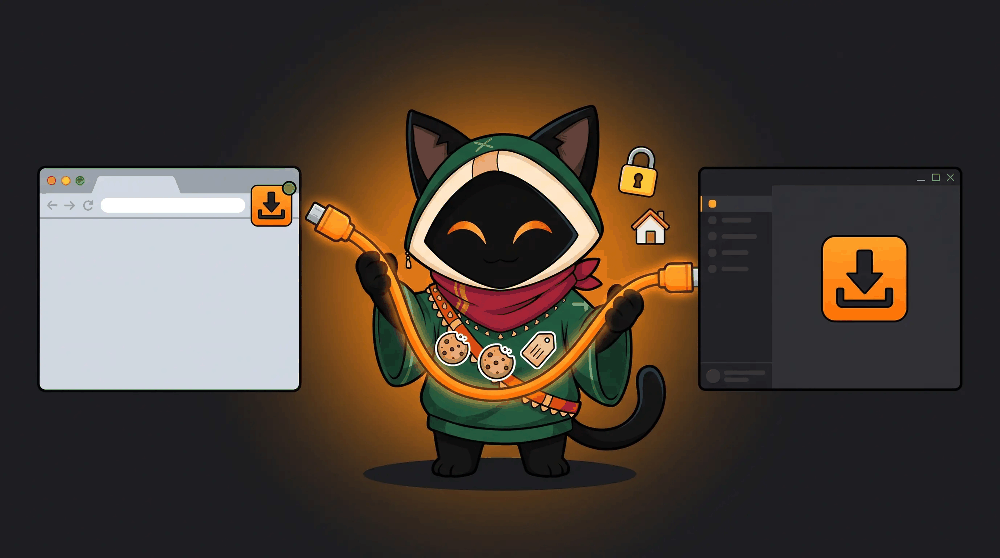
</p>

### Level 1: from inside the app (no downloads, no zip files)

1. Open OmniGet and install it if you have not. Launch it once.
2. Go to **Settings → Plugins → Browser extension**. Click **Update / Install** next to Chrome. OmniGet copies the extension that ships inside it to a folder and opens that folder for you.
3. Open Chrome (Edge, Brave and other Chromium browsers work the same way) and type `chrome://extensions` in the address bar.
4. Turn on **Developer mode** with the switch in the top right corner.
5. Click **Load unpacked** and pick the folder OmniGet just opened.
6. The OmniGet icon appears in the toolbar. An options page opens on its own and says it is looking for the app.
7. Back in OmniGet, still in **Settings → Plugins → Browser extension**, click **Pair extension**. Within a few seconds the app says "Extension connected" and the options page turns green. Done.

From now on, visit any supported page and click the icon. The page, its cookies and its title go to OmniGet and the download starts. Your cookies also show up in **Settings → Cookies**, where the Courses plugin and the Instagram, X and Pinterest tools reuse them.

### Level 2: from the release zip

Every release ships `omniget-chrome-extension-vX.Y.Z.zip`. Download it from the [latest release](https://github.com/tonhowtf/omniget/releases/latest), unzip it, then follow steps 3 to 7 above pointing **Load unpacked** at the unzipped folder. Use this if you keep the app on one machine and the browser on another, or if you are installing for someone else.

### Level 3: Firefox, other browsers and manual pairing

Firefox: **Settings → Plugins → Browser extension → Update / Install** next to Firefox, then open `about:debugging#/runtime/this-firefox`, click **Load Temporary Add-on** and pick `manifest.json` in the exported folder. Firefox keeps a temporary add-on until it restarts, so load it again after a restart.

Manual pairing: if **Pair extension** times out, open the extension's options page (right-click the icon → Options), then in OmniGet reveal and copy the **Pairing token** and paste it into the options page. The endpoint URL is detected automatically. The app listens on `127.0.0.1` ports 47720 to 47729 and the token is generated per install, so nothing leaves your machine.

If the extension is installed but OmniGet is closed, clicks fall back to the `omniget://` link scheme, which queues the URL right away; with the app open, cookies travel too. Tick "Always allow" the first time Chrome asks.

---

## The Tools section: 156 tools in 24 categories

Tools is the part of OmniGet that grew beyond downloading. Each tile is one job: an isolated Rust command with JSON in and JSON out, which is also what lets AI agents drive them through the built-in MCP server. The hub has a search box that understands English and Portuguese ("legenda" finds subtitle tools) and a platform filter, and tools that only run on Windows say so on the tile and stay hidden elsewhere. Everything below runs on your machine; the only tools that touch the network are the ones that fetch from the site they are named after.

<p align="center">
  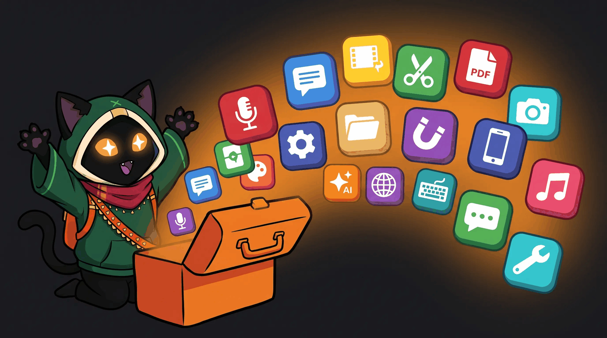
</p>

<p align="center">
  
</p>

Status legend: no mark means ready, **beta** marks the newest tools, **planned** marks what is next on the roadmap.

<table>
  <tr>
    <td></td>
    <td></td>
  </tr>
  <tr>
    <td></td>
    <td>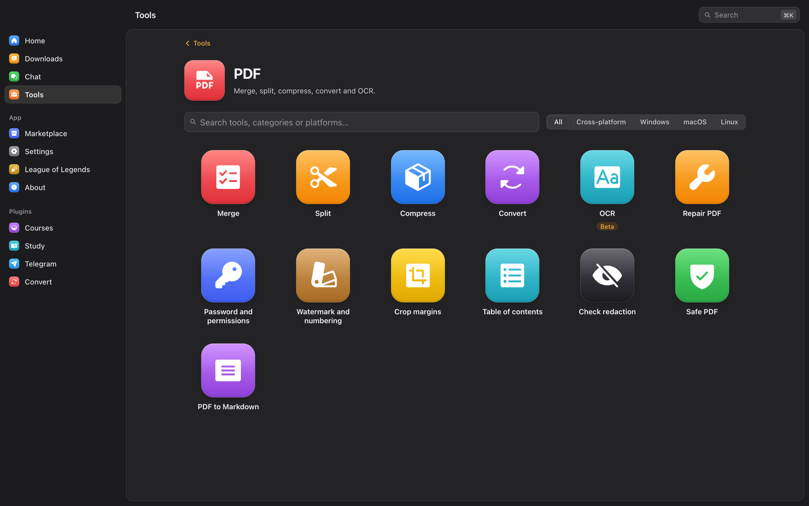</td>
  </tr>
  <tr>
    <td>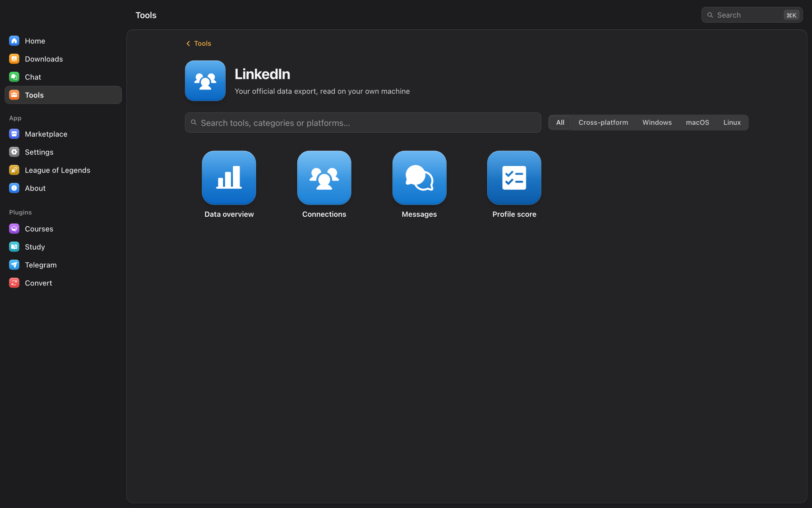</td>
    <td>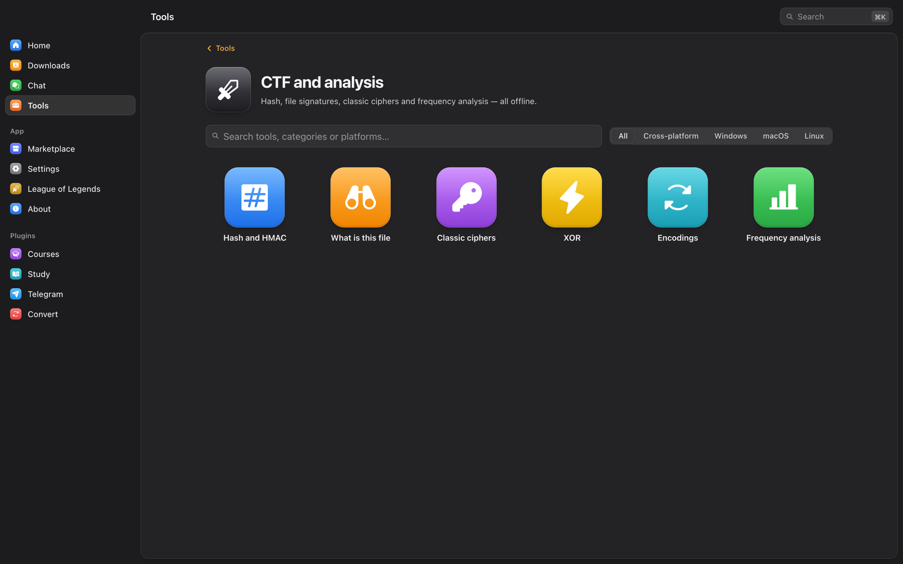</td>
  </tr>
</table>

### YouTube (11)

- **Download video.** Paste a link and pick quality, format and subtitles. Same engine as the home screen.
- **Metadata.** Save the info, description and thumbnail without the video.
- **Thumbnails.** Browse every cover image and save it at any resolution.
- **Subtitles.** Download subtitles, or merge two languages into one bilingual file.
- **Comments and chapters.** Fetch comments or chapter markers, filter them, export JSON or CSV.
- **Live chat.** Save the chat replay of a stream as JSON or CSV.
- **Subtitle workshop.** Edit, translate and re-time SRT, VTT and ASS files with a waveform, two-point sync, find and replace, an auto fix, and AI grammar and translation.
- **SponsorBlock.** See sponsor, intro and outro segments and get the yt-dlp flags to skip them.
- **Dislikes.** Likes, dislikes and rating from Return YouTube Dislike.
- **Real thumbnail.** The frames the CDN already has at 25, 50 and 75 percent, instead of the clickbait cover.
- **Force H.264.** A switch in the browser extension that keeps YouTube on H.264 instead of VP9 and AV1, for machines that stutter on newer codecs.

### Speech and subtitles (8)

- **Transcribe.** Audio or video to subtitles with [whisper.cpp](https://github.com/ggml-org/whisper.cpp), offline. Models download on demand, Metal acceleration on macOS.
- **Text to speech.** Natural voices from Microsoft Edge, free, with a synced subtitle file.
- **Translate subtitles.** Translate an SRT with your AI provider or a LibreTranslate server, keeping the timing.
- **Dub from subtitles.** Turn an SRT into a voice track that fits each line and optionally replace the video's audio. *beta*
- **Clone a voice**, **Design a voice** and **Isolate vocals** through a VoiceStudio install running on your machine. *beta*
- **Dictation.** Press a global shortcut, speak, and whisper types the text where your cursor is. *beta*

### Video editing (14)

- **Cut a clip.** Pick a video on disk and cut out a section. The result lands in the downloads queue.
- **Convert.** Change container, codec or resolution, or compress, through the Convert plugin.
- **Compress to a size.** Hit an exact target, 10 MB for Discord or 25 MB for e-mail, with two-pass encoding.
- **Video to GIF.** A clip as a GIF or animated WebP, with a palette that does not look muddy.
- **Cut silence.** Find the dead air in a recording and cut it from picture and sound together.
- **Convert subtitles.** SRT, VTT and ASS between each other, or burn one into the picture.
- **Resync subtitles.** Late, early or drifting: shift it, stretch it for another frame rate, or fix it with two anchors.
- **Restore video.** Take out flicker, grain and banding with the filters FFmpeg already carries.
- **Stabilize video.** Two-pass vidstab: measure the shake across the whole clip, then undo it.
- **Photo to sticker.** A photo or a clip into a WhatsApp or Telegram sticker that actually fits the size limit.
- **Auto captions** and **Text to speech** open the speech tools above.
- **Record screen.** Screen and system audio through FFmpeg, with a replay buffer that saves what just happened. *beta*
- **Timeline editor.** *planned*

### Audio (2)

- **Normalize loudness.** Two-pass EBU R128, so the audio lands where streaming, podcast or broadcast expects it.
- **Remove noise.** Hiss, fan and room noise taken out of a recording, with nothing to download.

### Instagram (24)

All of these run on your own Instagram session captured by the browser extension, so stories, close friends and your own lists work. Reads are paced and write actions stop on the first sign of a rate limit.

- **Download post.** Photo, video, reel, IGTV or carousel from a link, best quality.
- **Download many links.** Paste a list or a `.txt` and get everything.
- **Reel audio.** Keep only the sound, as M4A or MP3.
- **Stories.** Download stories, including close friends, without marking them as seen.
- **Highlights.** One highlight or every highlight of a profile.
- **Who viewed my story.** List and export viewers of each active story.
- **Profile viewer.** Bio, counts, HD photo and whether the account follows you.
- **Profile picture in HD.**
- **Download a profile.** All posts, reels, tagged or saved posts, with a limit you choose.
- **Who doesn't follow back.** Compare followers and following, protect accounts with a whitelist, unfollow at a safe pace.
- **Fans.** Accounts that follow you but you don't follow back, with the option to remove them.
- **Mutuals.**
- **Who unfollowed me.** Snapshots of your lists over time show who left and who arrived.
- **Ghost followers.** Followers who never like or comment, and the ones who engage the most.
- **Whitelist.** Accounts never suggested for unfollowing.
- **Data export.** Read Meta's "Download your information" zip offline: pending requests, close friends, blocked and more.
- **Profile analytics.** Engagement rate, cadence, best days and hours, hashtags and top posts of any public profile.
- **Compare profiles.** Up to six profiles side by side.
- **Hashtag explorer.** Post count, recent and top posts, related hashtags, download.
- **Export comments.** All comments of a post as CSV, with filter.
- **Who liked.** List and export the accounts that liked a post.
- **Giveaway picker.** Draw winners among the comments with rules for mentions, keyword and one entry per person.
- **Publish.** Photo, carousel, reel, video or story through your session or the official Graph API. *beta*
- **Schedule posts.** Queue posts for a date and time. OmniGet publishes them while it is open. *beta*

### X / Twitter (10)

Public data comes through the FxTwitter API without login. Anything private (bookmarks, your follows, Grok on X) uses your X session from the cookie manager.

- **Download post.** Videos, images and GIFs from any post.
- **Unroll thread.** The whole thread on one page, exported as Markdown, HTML or text.
- **Post to image.** A clean PNG card of a post for sharing anywhere.
- **Profile X-ray.** Engagement, best time to post, top posts and hashtags of any account.
- **Profile media.** Every photo and video from a profile, original quality, in one go.
- **Advanced search.** Build queries with X operators, see trends, export results.
- **Export bookmarks.** All bookmarks with folders, to JSON, CSV, Markdown or HTML. *beta*
- **Who doesn't follow back.** Audit following vs. followers and unfollow safely with a whitelist. *beta*
- **Your X archive.** Open the data zip offline: stats, top posts, likes and follow lists.
- **Grok.** Ask Grok with live X search or summarize a thread, through the xAI API or your X session. *beta*

### Reddit (3)

- **Download post.** Video with sound from v.redd.it, galleries, single images and outside links.
- **Archive thread.** The post and every comment as Markdown, a browsable HTML page and raw JSON, while they are still there.
- **Read my data export.** The official Reddit data zip turned into a summary you can actually read.

### Pinterest (10)

Works without login for anything public. Cookies are only needed for secret boards and for unsaving.

- **Download pin.** Image in original quality, video as MP4, GIF, carousel or story pages.
- **Board backup.** Every pin of a board or section with originals, videos, CSV/JSON and incremental sync.
- **Profile backup.** All public boards of a profile, one folder per board, plus created pins.
- **Search without AI or ads.** Filters that hide AI images, promoted pins and videos, then download.
- **Similar pins.** The "More like this" of any pin, filterable and downloadable.
- **Find the source.** Destination link, creator, dead-link check, Wayback Machine and reverse image search.
- **Duplicates in a board.** Identical and near-identical pins, with optional unsave.
- **Color palette.** Palette of a board or pin as hex, CSS or JSON.
- **Offline gallery, PDF, CSV.** A board as a searchable HTML gallery, a PDF moodboard or a spreadsheet.
- **Keyword ideas.** Search suggestions, refinements and the words top pins use.

### Twitch (2)

- **Emote pack.** Every emote and badge of a channel, from Twitch, BTTV, FFZ and 7TV, sorted by provider.
- **VOD chat.** The whole chat replay of a VOD or clip as JSON, CSV and subtitles, with the busiest minutes marked.

### Bilibili (2)

Video downloads from Bilibili live on the home screen. These two are about the floating comments.

- **Danmaku export.** A video's danmaku as XML, ASS or JSON without downloading the video.
- **Burn danmaku.** Paint the comment track onto a local clip and get a shareable MP4.

### Spotify (2)

- **Themes and colors.** Customize the Spotify client with Spicetify themes. *beta*
- **Extensions.** Install Spicetify extensions and custom apps from its Marketplace. *beta*

### Music (3)

- **Playlist to M3U.** Match an exported playlist with the audio files you own and write `.m3u8` and `.pls` for any local player.
- **Synced lyrics.** Fetch lyrics from LRCLIB and save an `.lrc` next to each track.
- **Spotify history.** Open your full data export and see everything Wrapped leaves out.

### LinkedIn (4)

All four read the official data export LinkedIn lets you request, on your own machine. Nothing logs in.

- **Data overview.** Connections, messages, posts and what advertisers know about you.
- **Connections.** Filter, group and export your connection list.
- **Messages.** Browse your chat history and save it as a local page.
- **Profile score.** An offline completeness check with what is missing.

### Games (3)

- **Switch album.** Import screenshots and clips from the Switch SD card, named by game and date.
- **Clip organizer.** Sort Game Bar, ShadowPlay, OBS and Steam captures into folders by game.
- **Runs on Linux?** The ProtonDB tier for one game or your whole Steam library.

### PDF (13)

- **Merge.** Join several PDFs into one, in the order you choose.
- **Split.** Extract pages or break a PDF into parts.
- **Compress.** Shrink a PDF while keeping it readable.
- **Convert.** PDF to images or Word, and back.
- **OCR.** Make scanned PDFs searchable. *beta*
- **Repair.** Rebuild a file that will not open: broken cross-reference table, truncated download, junk before the header.
- **Password and permissions.** Lock a PDF with AES-128, or take the password off one you can already open.
- **Watermark and numbering.** Stamp text across every page, or Bates-number a batch for filing.
- **Crop margins.** Cut the white border so the text fills an e-reader screen, found automatically or set by hand.
- **Table of contents.** Read the bookmarks a PDF has, or give one that has none a proper outline.
- **Check redaction.** Find text that is still in the file underneath a black bar, and read it back to you.
- **Safe PDF.** Rebuild a PDF from pixels to strip scripts and forms.
- **PDF to Markdown.** Clean Markdown with headings, lists and tables, ready to paste into an LLM.

### Documents (5)

- **SlideShare to PDF.** Every slide at the largest size, assembled into one PDF.
- **Google Docs export.** Public Docs, Slides and Sheets as PDF, DOCX, PPTX or XLSX.
- **Calameo pages.** Save the pages of a Calameo publication as SVG or JPG. *beta*
- **Image galleries.** Whole galleries and profiles from 250+ sites with gallery-dl.
- **Scribd.** Save readable books as PDF using your own session. *planned*

### Images (9)

- **Upscale.** Real-ESRGAN on any Vulkan GPU, 2x, 3x or 4x. *beta*
- **Resize images.** Batch resize by width, height, fit or percent, converting the format if you want.
- **Compress to a size.** Hit a target in KB by searching for the best quality that still fits, and say so when it cannot.
- **Metadata and GPS.** See what a photo carries, location, camera and serial number, and strip it without touching the pixels.
- **Duplicate photos.** The same picture saved twice, recompressed, resized or cropped, not just byte-identical copies.
- **Stitch screenshots.** Join scrolled screenshots into one long image without repeating what overlaps.
- **Icon pack.** One image into `favicon.ico`, the web PNGs, `apple-touch-icon` and a macOS `.icns`.
- **Spritesheet.** Slice a sheet into frames, pack frames back with an atlas, or resize a folder by rule.
- **OCR.** Copy the text out of images and slides. *beta*

### System (10, Windows-only items marked)

- **Clean caches.** Temp files, logs and app caches with rules per operating system. You review the list before anything is deleted.
- **Disk analyzer.** What takes space, as a treemap plus the largest files, with a send-to-trash button.
- **Block ads by hosts.** Point ad and telemetry domains at nothing, inside a block of its own that never touches your own lines.
- **Startup manager.** See what launches with the system and switch items off. *beta*
- **Uninstaller.** Remove apps and the leftovers they leave behind. *beta*
- **Privacy shield.** Control Windows telemetry, ad ID and tracking settings. Windows. *beta*
- **Harden Windows.** Macros, AutoRun, script host, UAC and Defender settings from hardentools, reversible. Windows. *beta*
- **Debloat Windows.** Remove preinstalled Store apps. Windows. *beta*
- **Registry cleaner.** Orphaned entries, with a `.reg` backup before removal. Windows. *beta*
- **Software updater.** Update programs in bulk through winget, Chocolatey and Scoop. Windows. *beta*

### Files (5)

- **Duplicates.** Find identical files by hash and free space safely.
- **Bulk rename.** Regex, counters and case changes with a preview before applying.
- **Secure delete.** Overwrite the file before removing it, so a recovery tool finds nothing.
- **Find files.** Instant search with Everything on Windows, Spotlight on macOS or fd on Linux.
- **Keep awake.** Stop the computer from sleeping during long jobs.

### Downloads (2)

- **Accelerated download.** Big files with 16 connections, resume and checksum via aria2.
- **HLS / DASH manifest.** Paste a `.m3u8` or `.mpd` with Referer and cookie. FFmpeg saves an MP4.

### Automation (1)

- **Auto clicker.** Click at the exact speed you set, with a global hotkey, limits and random ranges. Windows, macOS and Linux. *beta*

### Phone (1)

- **Send to phone.** Files, links and text to a paired KDE Connect device.

### AI (6)

- **Compare prices.** The cost of the same model across providers, with prices from LiteLLM and models.dev.
- **AI spending.** How much OmniGet spent on AI, by day, model and task, from a local ledger.
- **Local models (Ollama).** See, download and remove local models and use them as a free provider.
- **Humanize text.** Rewrite AI-sounding text so it reads like a person wrote it, without changing what it says. Runs on the AI provider you configured. *beta*
- **API keys.** A local vault for keys and accounts, with a connection test, balance for OpenRouter, DeepSeek, SiliconFlow and New API, and export to Claude Code, Codex, Cherry Studio, opencode or a `.env` file.
- **MCP server.** OmniGet's tools exposed over the Model Context Protocol on the local bridge, 49 tools behind the same token the extension uses, with ready-made config snippets for Claude Code, Claude Desktop, Cursor, VS Code, Goose and Codex. See [OmniGet for AI agents](#omniget-for-ai-agents-mcp-server-and-claude-code-plugin). *beta*

### CTF and analysis (6)

Six small offline utilities for capture-the-flag puzzles, forensics homework and "what is this file" moments.

- **Hash and HMAC.** MD5, the SHA family, CRC-32 and HMAC of text or a file, plus a guess at what an unknown hash is.
- **What is this file.** Signature, readable strings, entropy, and anything hidden past the end of the real file.
- **Classic ciphers.** Caesar, ROT13, Atbash, Vigenère and Rail Fence, with a brute force that picks the readable answer.
- **XOR.** Apply a key, or recover one: a single byte by letter frequency, a repeating key by Hamming distance.
- **Encodings.** base64, base32, hex, URL, HTML entities, binary and morse, both directions, with detection.
- **Frequency analysis.** Histogram, entropy and index of coincidence, and what that combination usually means.

Every tool that talks to an AI uses the provider you set in **Settings → AI**: OpenAI, Anthropic, or any OpenAI-compatible local endpoint such as Ollama or LM Studio. The key is stored locally and never logged. The auto clicker, dictation and the replay buffer can each get a global shortcut of their own.

---

<a id="omniget-for-ai-agents-mcp-server-and-claude-code-plugin"></a>

## MCP server for Claude Code, Cursor and VS Code, and a Claude Code plugin

<p align="center">
  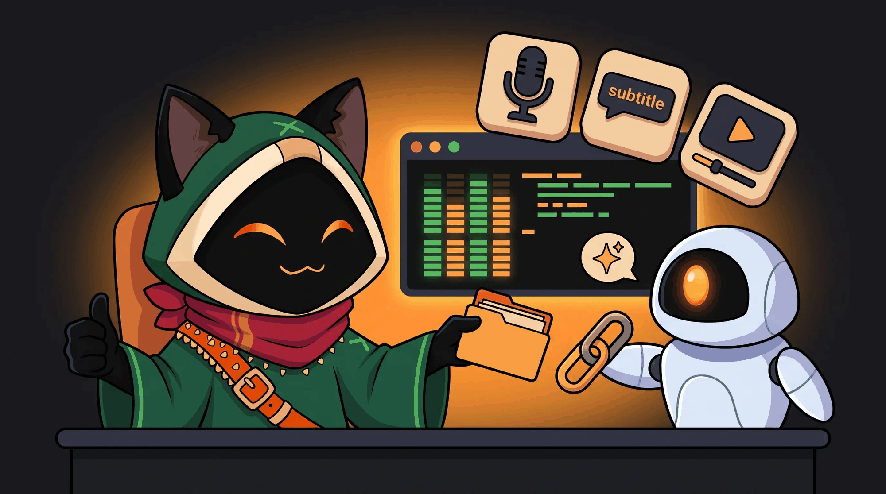
</p>

Three doors, depending on where your agent lives.

**Inside the app: the MCP server.** Turn it on in Tools → AI → MCP server and OmniGet exposes 49 of its tools over the Model Context Protocol on the same local bridge the browser extension uses, behind the same per-install token. An agent can queue a URL and watch, pause, resume or cancel it in the Downloads panel, merge, split, render, extract text from or sanitize PDFs, transcribe a file with whisper.cpp, run text to speech and OCR, resize images, find duplicates, search files, read X posts, threads, profiles, searches and trends, look up an Instagram profile through your session, compare LLM prices, humanize text, scan disks and caches, list startup items and installed apps, and pull large files or galleries with aria2 and gallery-dl. New in 0.10, the same server carries the coding tools of the built-in harness, confined to the folder you attached in the app (read, list, glob, grep, edit, write, apply a patch, run a sandboxed command, keep a plan), the project knowledge base (`kb_search`, `kb_write`) and `agent_delegate`, which hands a task to an agent of your roster. The page prints the config snippet for Claude Code, Claude Desktop, Cursor, VS Code, Goose and Codex, so it is a paste, not a setup.

**The other way round: MCP servers for your agents.** In **LLM → MCP** you plug external MCP servers into OmniGet, over stdio or streamable HTTP, and their tools show up next to the built-in ones as `mcp:<server>:<tool>`. Each agent gets them one by one, as *auto*, *ask* or *deny*, and a server can never shadow a built-in tool. Secrets in a server's environment or headers are stored as references and resolved only when the server starts. Nothing connects until you enable a server.

**Inside Claude Code: the `omniget` plugin.** The [`claude-plugin/`](claude-plugin/omniget) folder ships a plugin for [Claude Code](https://claude.com/claude-code) that needs no desktop app at all. Paste a video, audio or social post URL with a request and the `omniget-fetch` and `omniget-transcribe` skills trigger on their own. The slash commands are there when you want to be explicit:

```
/plugin marketplace add /path/to/omniget/claude-plugin
/plugin install omniget
/omniget:setup                       # installs yt-dlp, ffmpeg and omniget-cli after one confirmation
/omniget:fetch <url> [--audio]       # the media file, to ~/Downloads/omniget
/omniget:transcribe <url|file>       # captions, then local whisper.cpp, then Gemini or OpenAI if you added a key
/omniget:research <url>              # caption plus transcript distilled into a Markdown note with [mm:ss] references
/omniget:doctor                      # what is installed, what is missing, how to add it
```

Setup downloads the prebuilt `omniget-cli` for your OS, which gives the skill OmniGet's native Instagram, X, Bilibili and Threads extractors. A download that fails on a login wall is retried once with the cookies of the browser you name in `OMNIGET_COOKIES_FROM_BROWSER`. API keys go into `~/.config/ai-keys.env` from your own terminal and are never printed back.

---

## Plugins: Courses, Study, Telegram, Convert

Plugins are separate Rust libraries loaded at startup. OmniGet installs its official set on first launch and updates them by itself. The Marketplace page shows what is installed, what each plugin is allowed to do (events, notifications, settings, download folders, proxy, managed tools, download queue), and lets you hide, disable or uninstall any of them.

<p align="center">
  
</p>

### Courses

Sign in to **Hotmart**, **Udemy**, **Kiwify**, **Rocketseat** or **Meta-Analysis Academy** through a browser window inside the app, with saved cookies from the extension, or with email and password where the platform allows it. OmniGet lists your purchases, opens the course outline so you can tick the sections you want (it tells you how many lectures are DRM-protected and will be skipped), and downloads every lesson and attachment with continuous lecture numbers if you want them. Hotmart uses the current OIDC login flow, so it keeps working after Hotmart's 2026 auth change, and free courses and courses delivered outside Hotmart Club are listed too. Downloaded courses appear in Study automatically.

### Study

Study turns the folder of files you downloaded into something you can actually finish.

<p align="center">
  
</p>

- Library and player. Point Study at your course folders (nothing is copied or moved). The player resumes to the second, and pressing **N** captures a note at the current timestamp that jumps back there when clicked.
- Reader. PDF, EPUB, DJVU, MOBI, AZW3, FB2, CBZ, CBR, TXT, RTF and HTML, with highlights, bookmarks, collections, a focus mode and a paper-like theme. Covers, titles and authors are pulled from the files.
- Notes. A Markdown and LaTeX editor with links between pages, a daily journal, templates, tags, a knowledge graph, and export to `.md` or PDF. Any note can become a flashcard.
- Anki. Spaced repetition decks with import from `.apkg`, `.txt` and CSV, filtered decks, presets, note types, tags, media, stats and a review log.
- Focus. Pomodoro and deep-work timers with daily and weekly targets that pause the player when the session ends.
- Progress and achievements. Streaks, daily goals, a year heatmap and local XP with no leaderboard.
- Music. Your local library with covers, artists and albums, synced lyrics, favorites, history, playlists, genres, transcoding, and browsers for Spotify, SoundCloud and YouTube Music so playlists and likes sit next to your files.

### Telegram

Sign in with a QR code or your phone number. Browse every channel and group you belong to, filter by photo, video, document or audio, search files, and download one item or the whole chat with a progress list. Videos from channels can be imported straight into the Study library.

### Convert

FFmpeg conversions with GPU acceleration where the machine has it: container, codec, resolution, bitrate and compression for video and audio, no internet required.

---

## For League of Legends players

A League menu sits in the sidebar. It reads your running League client locally, with no account and no third-party build site, and does nothing until the client is open. If you never play, switch it off in **Settings → Advanced → League of Legends** and the menu disappears.

<p align="center">
  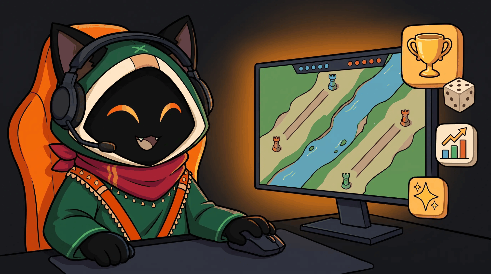
</p>

Match scouting for both teams with rank, recent form, KDA and the champions each player actually plays. Win probability that shrinks win rates toward the baseline by sample size and always shows a range. Live gold, CS and level for all ten players. Goals per role you can edit. Runes and summoner spells recommended by the client itself, applied in one click and only ever replacing the page OmniGet created. Champion tiers by role. Player search by Riot ID. Opt-in automation: accept matches, pick and ban from your priority list, grab a champion off the ARAM bench. Every automation has its own switch.

Also in the League menu: a **Profile** tab that edits what other players see (rank shown in chat, challenge medals and title, banner and crest, chat icon, bulk friend management); a **skin, chroma and ward roulette** that rolls an owned skin the moment you lock in, with rerolls; a **champion and lane raffle** for when you want the queue to decide, plus an optional random pick in champion select; full **match history and ranked stats for any player** through the client's own backend gateway, with replay download; and an **AI coach** that reviews a game, spots trends over your last matches or answers a question about the current champ select, using your configured AI provider and OP.GG's public data.

---

## Everything else in the box

- Command palette (**Ctrl+K** or **Cmd+K**) that jumps to any page, setting or tool.
- Clipboard detection that offers to download a copied link with one click on a toast.
- Cookie manager that keeps sessions per site, captured by the extension or imported from a `cookies.txt`, with a test button per domain.
- Video summaries: paste a URL in **Settings → AI**, OmniGet fetches the subtitles and summarizes them in the length and language you choose.
- Send a file to someone: pick a file, share the word code, the other person pastes it in their OmniGet.
- Discord Rich Presence showing what you are listening to, watching or reading. Downloads stay private.
- Tray icon, start with system, start minimized, prevent sleep during downloads.
- Every download keeps the exact yt-dlp command it ran. Open it, edit a flag, retry.
- 14 themes, including Catppuccin (four flavors), Dracula, One Dark Pro, three e-ink variants and three Nyxvamp variants.
- 12 languages: English, Portuguese, Spanish, French, Italian, Greek, Russian, Japanese, Persian, Lao, Simplified and Traditional Chinese.
- Runs on Windows, macOS (Apple Silicon and Intel) and Linux (x86_64 and ARM64).

---

## Privacy and what OmniGet refuses to do

<p align="center">
  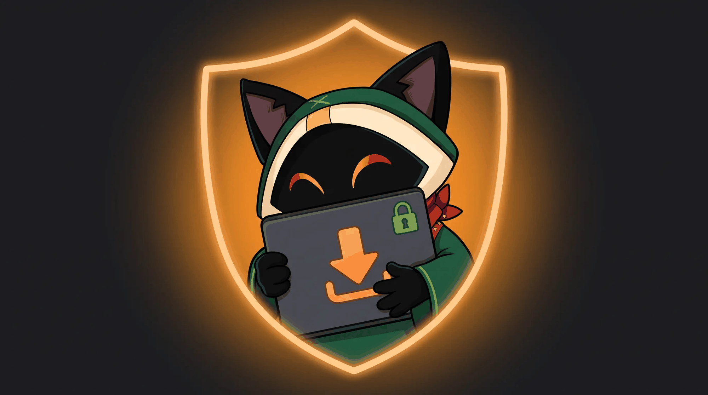
</p>

Everything runs on your computer. There is no account, no server of ours in the middle, and no telemetry about what you download. Cookies and API keys live in your local profile. The only network calls OmniGet makes on its own are to the sites you asked it to download from, to GitHub for updates and plugins, and to the AI provider you configured, when you use an AI tool.

OmniGet downloads what your own logged-in session can already open. It does not bypass DRM, break paywalls, or share credentials, and DRM-protected lectures are skipped and reported. You are responsible for respecting copyright and each platform's terms of service. The full text is in the app under **About → Terms and ethics**.

---

## Frequently asked questions

### Is OmniGet free?

Yes. OmniGet is free and open source under GPL-3.0, with no paid tier, no ads and no account.

### Is OmniGet a yt-dlp GUI?

Yes. OmniGet bundles yt-dlp, verifies it, keeps it updated and puts its options in a window. On top of that sit native extractors for courses, Instagram, X, Pinterest, Bilibili, Telegram and torrents, a queue with resume and retry, 156 tools, the Study library and the AI agents.

### Can OmniGet download a Udemy or Hotmart course I bought?

Yes. The Courses plugin comes preinstalled: sign in through the app, pick the course and its sections, and download. Lessons and attachments land in a folder per course and appear in Study. Kiwify, Rocketseat and Meta-Analysis Academy work the same way.

### How do I download a YouTube video or playlist without a terminal?

Paste the link on the home screen, pick the quality and press Enter. Playlists, channels, subtitles, chapters and audio-only MP3 are options in the same window, and yt-dlp runs underneath without you typing a flag.

### Can it download Instagram stories, close friends or highlights?

Yes, using your own session captured by the browser extension. Stories are downloaded without being marked as seen.

### Can it download an X video, a whole thread or all media from a profile?

Yes. Public posts need no login. Bookmarks and your own follow lists use your X session.

### Can it back up a Pinterest board in original quality?

Yes, including videos, sections, secret boards with cookies, and incremental sync that fetches what is new.

### Can I run Claude Code without a terminal?

Yes. Add your Claude Code account in **LLM → Accounts** and it becomes an agent in the app: you chat in a window, attach a folder, see every diff before it is written, and undo a turn with one click. It keeps the login your terminal already has. Codex works the same way, and Gemini CLI, goose and opencode join through the Agent Client Protocol.

### Can an AI agent keep working until the tests pass?

Yes. A Loop takes a prompt and a check command such as `npm test` or `cargo test`, and repeats rounds until the check exits 0 or your round or minute budget ends. It keeps running with the window closed, and `omniget agent loop` starts one from a terminal.

### Does it work with Ollama only, offline?

Yes. A fresh install is local first: point it at Ollama, LM Studio or llama-server and the agents run on your machine with no key and no internet. `qwen3:8b` fixes the demo bug in about 3 minutes.

### Is my code sent anywhere?

Your code goes to the model you chose and nowhere else. With a local model it never leaves your computer. OmniGet has no server in the middle and no telemetry, and nothing talks to the network until you add a key, start a local model or open your house.

### Can I use OmniGet as an MCP server for Claude Code, Cursor or VS Code?

Yes. Tools → AI → MCP server exposes 49 tools over the Model Context Protocol, and the page prints the config snippet for Claude Code, Claude Desktop, Cursor, VS Code, Goose and Codex. The `claude-plugin/` folder also ships a Claude Code plugin that fetches and transcribes media without the desktop app. See [MCP server](#omniget-for-ai-agents-mcp-server-and-claude-code-plugin).

### Can several AI agents work together?

Yes. `agent_delegate` lets one agent hand a task to another and get the answer back as a tool result, the team shares a project memory in `AGENTS.md` and `.omniget/kb/`, and the World shows each agent at its own workbench while it works.

### Does it resume interrupted downloads?

Yes. Partial files are kept and continued, and rate limits trigger retries with backoff.

### Which formats can it save?

Video as MP4, MKV or WebM. Audio as MP3, M4A, Opus, FLAC or WAV. Subtitles as SRT, VTT or ASS, embedded or beside the file.

### Does it need Python, Node or a terminal?

No. Download the app, open it, paste a link. yt-dlp and FFmpeg install themselves and stay updated.

### macOS says the app is damaged. What do I do?

Run the two commands in [the first launch section](#the-first-launch-warning-and-how-to-clear-it). You do it once.

### Can it read my Reddit, LinkedIn, Spotify, X or Instagram data export?

Yes. Request the export from the platform, then open the zip in the matching tool. It is parsed on your machine and nothing is uploaded.

### Can I transcribe a video to subtitles offline?

Yes. Tools → Speech and subtitles → Transcribe uses whisper.cpp locally. Models download on demand.

### Can I run it from a USB stick?

Yes, on Windows, with a `portable.txt` file next to the executable.

### Which Linux package should I pick?

Debian and Ubuntu: `.deb`. Fedora, openSUSE, RHEL family: `.rpm`. Anything else: `.AppImage`. Both x86_64 and ARM64 are published.

---

## Command line

`omniget-cli` ships with every release for Windows, macOS (Intel and Apple Silicon) and Linux. Grab `omniget-cli-<version>-<target>` from the [latest release](https://github.com/tonhowtf/omniget/releases/latest).

```bash
omniget info <url>                     # title, formats and size, downloads nothing
omniget download <url> -q 1080 -o ~/Videos
omniget download <url> --audio-only --subs en,pt
omniget batch links.txt -m 3           # one URL per line, 3 at a time
omniget import-cookies cookies.txt     # Netscape format

# agents, through the running desktop app
omniget agent run "fix the failing test in src/cart.js"        # current folder is the workspace
omniget agent loop "make the suite pass" --check "npm test" --minutes 30
omniget agent jobs                     # recent jobs; `omniget agent jobs <id>` follows one
```

---

## Build from source

If you only want to use OmniGet, [grab a release](#download-and-install). To build it you need [Rust](https://rustup.rs/) (the exact toolchain is pinned in `rust-toolchain.toml` because the plugin ABI depends on it), [Node.js](https://nodejs.org/) 18+ and [pnpm](https://pnpm.io/).

```bash
git clone https://github.com/tonhowtf/omniget.git
cd omniget
pnpm install
pnpm tauri dev
```

<details>
<summary>Linux build dependencies</summary>

```bash
sudo apt-get install -y libwebkit2gtk-4.1-dev build-essential curl wget file libxdo-dev libssl-dev \
  libayatana-appindicator3-dev librsvg2-dev patchelf libasound2-dev libpipewire-0.3-dev clang libclang-dev
```

</details>

Production build:

```bash
pnpm tauri build --config '{"bundle":{"createUpdaterArtifacts":false}}'
```

Releases sign their updater artifacts with a private key only the maintainer holds, so a plain `pnpm tauri build` stops with "A public key has been found, but no private key". The flag above turns those artifacts off for a local build and changes nothing else.

The plugins live in their own repositories: [omniget-plugin-courses](https://github.com/tonhowtf/omniget-plugin-courses), [omniget-plugin-telegram](https://github.com/tonhowtf/omniget-plugin-telegram), [omniget-plugin-convert](https://github.com/tonhowtf/omniget-plugin-convert) and [omniget-study-release](https://github.com/tonhowtf/omniget-study-release). The registry is [omniget-plugins](https://github.com/tonhowtf/omniget-plugins). `pnpm plugins:deploy` builds the sibling plugin checkouts and copies them into your local data folder.

Stack: Tauri 2, Rust, SvelteKit with Svelte 5, SQLite, yt-dlp, FFmpeg, librqbit for torrents, whisper.cpp, aria2, gallery-dl.

---

## Contributing and translations

Bug reports and pull requests go to [Issues](https://github.com/tonhowtf/omniget/issues) and [Pull requests](https://github.com/tonhowtf/omniget/pulls). Questions and quick help live on [Discord](https://discord.gg/jgdxyPy7Vn).

Translations are managed on [Weblate](https://hosted.weblate.org/engage/omniget/). Pick your language and translate in the browser. New strings appear there a few hours after they land in `main`.

OmniGet is built on [yt-dlp](https://github.com/yt-dlp/yt-dlp), [FFmpeg](https://ffmpeg.org/), [gallery-dl](https://github.com/mikf/gallery-dl), [whisper.cpp](https://github.com/ggml-org/whisper.cpp), [aria2](https://aria2.github.io/), [SponsorBlock](https://sponsor.ajay.app/), [Return YouTube Dislike](https://returnyoutubedislike.com/), [FxTwitter](https://github.com/FixTweet/FxTwitter), [Spicetify](https://spicetify.app/), [cat-catch](https://github.com/xifangczy/cat-catch) (parts of the extension's media sniffer) and [Tauri](https://tauri.app/). Thank you to everyone who maintains them.

Loop, the creature on the home screen, is OmniGet's mascot. Fan art is welcome. The original artwork may not be used commercially or redistributed modified. The illustrations in this README were generated with [Higgsfield](https://higgsfield.ai) from the original Loop artwork.

<p align="center">
  <a href="https://star-history.com/#tonhowtf/omniget&Date"></a>
</p>

<p align="center">
  <a href="https://github.com/tonhowtf/omniget/releases/latest"><b>Download OmniGet</b></a> · <a href="LICENSE">GPL-3.0</a>
</p>

---

## Standing on open source

OmniGet reads a lot of open source before it writes its own. Thank you to the projects whose ideas shaped the agents, the jobs and the World: [opencode](https://github.com/anomalyco/opencode), [Codex](https://github.com/openai/codex), [aider](https://github.com/Aider-AI/aider), [cline](https://github.com/cline/cline), [compozy](https://github.com/compozy/compozy), [codex-loop](https://github.com/compozy/codex-loop), [cc-loop](https://github.com/compozy/cc-loop), the [Agent Client Protocol](https://agentclientprotocol.com), [mem0](https://github.com/mem0ai/mem0), [letta](https://github.com/letta-ai/letta), [headroom](https://github.com/headroomlabs-ai/headroom), [yoshi](https://github.com/compozy/yoshi), [fast-jev-compaction](https://github.com/tamaratran/fast-jev-compaction), [ai-town](https://github.com/a16z-infra/ai-town), [smallville](https://github.com/nmatter1/smallville) and the [generative agents](https://github.com/joonspk-research/generative_agents) paper. And to [yt-dlp](https://github.com/yt-dlp/yt-dlp), [FFmpeg](https://ffmpeg.org), [Tauri](https://tauri.app) and [Svelte](https://svelte.dev), which everything else stands on.
