<!--
Palavras-chave de busca (ficam aqui para a busca do GitHub, o Google e os assistentes de IA acharem o projeto):
OmniGet é um downloader e caixa de ferramentas de mídia, gratuito e open source, para Windows, macOS e Linux.
baixar curso udemy, baixar curso hotmart, baixar curso kiwify, downloader de cursos, baixar video youtube,
yt-dlp gui, baixar instagram, baixar story instagram, baixar reels, baixar video twitter, baixar video x,
baixar pinterest, backup de board pinterest, baixar tiktok, baixar reddit, baixar vod twitch, baixar bilibili,
baixar telegram, cliente torrent, magnet, baixar legendas, transcrição whisper, texto para fala, leitor epub,
leitor pdf, flashcards anki, repetição espaçada, player de música, spicetify, gerenciador de downloads, tauri, rust, svelte.
-->

<p align="center">
  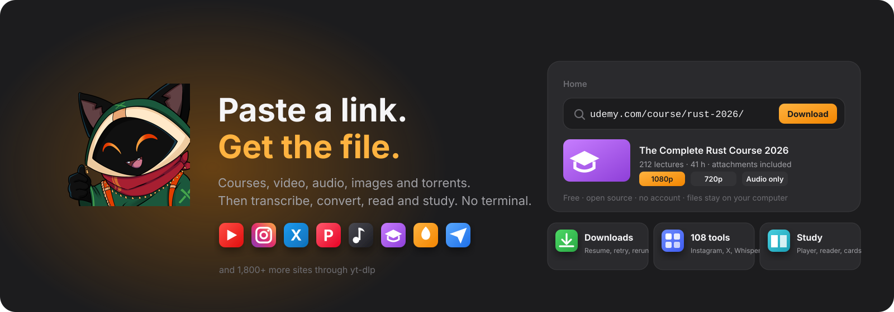
</p>

<h1 align="center">OmniGet</h1>

<p align="center">
  <a href="README.md">English</a>
  · <b>Português (BR)</b>
  · <a href="README.ru.md">Русский</a>
  · <a href="README_zh_CN.md">简体中文</a>
</p>

<p align="center">
  <sub>Tradução para o português do Brasil iniciada por <a href="https://github.com/alvarorichard">@alvarorichard</a> (<a href="https://github.com/tonhowtf/omniget/pull/280">PR #280</a>). Obrigado.</sub>
</p>

<p align="center">
  <b>Baixe cursos da Udemy e da Hotmart, YouTube, Instagram, X, Pinterest, TikTok e mais de 1.800 outros sites.<br/>Depois transcreva, converta, leia e estude o que salvou. Um único app de desktop, gratuito, sem terminal.</b>
</p>

<p align="center">
  <a href="https://github.com/tonhowtf/omniget/releases/latest"></a>
  <a href="https://github.com/tonhowtf/omniget/releases"></a>
  <a href="https://github.com/tonhowtf/omniget/stargazers"></a>
  <a href="LICENSE"></a>
  <a href="https://discord.gg/jgdxyPy7Vn"></a>
  <a href="https://hosted.weblate.org/engage/omniget/"></a>
</p>

<p align="center">
  <a href="#baixar-e-instalar"></a>
  &nbsp;
  <a href="#a-seção-tools-108-ferramentas-em-16-categorias"></a>
</p>

<p align="center">
  <sub>Gratuito. Open source sob GPL-3.0. Sem conta, sem anúncios, sem telemetria do que você baixa. Seus arquivos ficam no seu computador.</sub><br/>
  <sub>Mais de 9.500 estrelas no GitHub. O repositório mais estrelado nos tópicos <a href="https://github.com/topics/udemy-downloader">udemy-downloader</a>, <a href="https://github.com/topics/hotmart-downloader">hotmart-downloader</a> e <a href="https://github.com/topics/course-downloader">course-downloader</a>.</sub>
</p>

<p align="center">
  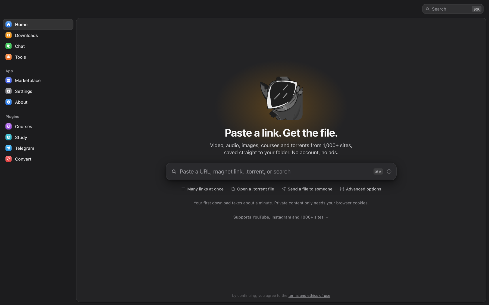
</p>

---

## Sumário

- [Por que o OmniGet](#por-que-o-omniget)
- [Baixar e instalar](#baixar-e-instalar)
- [Seu primeiro download em um minuto](#seu-primeiro-download-em-um-minuto)
- [O que o OmniGet baixa](#o-que-o-omniget-baixa)
- [A extensão do navegador, passo a passo](#a-extensão-do-navegador-passo-a-passo)
- [A seção Tools: 108 ferramentas em 16 categorias](#a-seção-tools-108-ferramentas-em-16-categorias)
- [Plugins: Courses, Study, Telegram, Convert](#plugins-courses-study-telegram-convert)
- [Chat embutido, desligado por padrão](#chat-embutido-desligado-por-padrão)
- [Para quem joga League of Legends](#para-quem-joga-league-of-legends)
- [Tudo o mais que vem na caixa](#tudo-o-mais-que-vem-na-caixa)
- [Privacidade e o que o OmniGet se recusa a fazer](#privacidade-e-o-que-o-omniget-se-recusa-a-fazer)
- [Perguntas frequentes](#perguntas-frequentes)
- [Linha de comando](#linha-de-comando)
- [Compilar do código-fonte](#compilar-do-código-fonte)
- [Contribuir e traduzir](#contribuir-e-traduzir)

---

## Por que o OmniGet

Você comprou um curso e quer ele no seu disco antes que a plataforma tire do ar. Você mantém uma colinha do yt-dlp porque as flags nunca ficam na cabeça. Tem um site para stories do Instagram, outro para vídeos do X, uma extensão de Chrome para o Pinterest, um script em Python para legendas, e nenhum deles lembra o seu login.

O OmniGet coloca tudo isso atrás de uma única caixa de texto. Cole um link, veja a prévia com as opções de qualidade, clique em baixar. A mesma janela depois reproduz o curso, abre o PDF, transcreve o áudio e faz backup do board do Pinterest. O yt-dlp e o FFmpeg se instalam e se atualizam sozinhos, então não há nada para configurar e nenhum terminal para abrir.

<p align="center">
  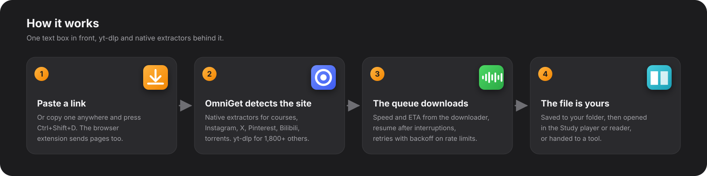
</p>

### Como se compara

| | OmniGet | yt-dlp sozinho | Downloaders web de um site só | Downloaders de cursos pagos |
|---|---|---|---|---|
| Sites | Cursos, Instagram, X, Pinterest, Bilibili, Telegram e torrents nativos, mais de 1.800 via yt-dlp | 1.800+ | Um | Uma ou duas plataformas |
| Instalação | Baixe um arquivo e abra | Python, PATH, FFmpeg, flags | Nenhuma | Instalador e chave de licença |
| Conteúdo logado | Cookies do seu navegador pela extensão | Exportar `--cookies` na mão | Raramente | Às vezes |
| Fila | Retomar, repetir com backoff, regras, canais seguidos | Um comando por vez | Não | Varia |
| Depois do download | Player, leitor, flashcards, notas, 108 ferramentas | Arquivos | Arquivos, muitas vezes recodificados | Arquivos |
| Preço e licença | Grátis, GPL-3.0 | Grátis, Unlicense | Grátis com anúncios | Assinatura |

O yt-dlp é o motor sobre o qual o OmniGet roda, e o OmniGet não existiria sem ele. Se você vive no terminal e só quer arquivos, o yt-dlp sozinho é a ferramenta certa.

---

## Baixar e instalar

Escolha o seu sistema. Todas as versões estão na [página de Releases](https://github.com/tonhowtf/omniget/releases/latest). As atualizações chegam dentro do app.

<table>
  <tr>
    <th align="left">Sistema</th>
    <th align="left">O que baixar</th>
    <th align="left">Outras formas</th>
  </tr>
  <tr>
    <td><b>Windows 10 / 11</b></td>
    <td><code>omniget_x.y.z_x64-setup.exe</code> (instalador)<br/><code>omniget_x.y.z_x64-portable.exe</code> (sem instalar, roda de qualquer pasta)<br/><code>omniget_x.y.z_x64_en-US.msi</code> (para TI)</td>
    <td><code>winget install -e --id tonhowtf.OmniGet</code></td>
  </tr>
  <tr>
    <td><b>macOS 10.15+</b></td>
    <td><code>omniget_x.y.z_aarch64.dmg</code> para Apple Silicon (M1 em diante)<br/><code>omniget_x.y.z_x64.dmg</code> para Macs Intel</td>
    <td><code>brew install --cask tonhowtf/tap/omniget</code></td>
  </tr>
  <tr>
    <td><b>Linux</b></td>
    <td><code>.deb</code> para Debian e Ubuntu (amd64 e arm64)<br/><code>.rpm</code> para Fedora, openSUSE e família RHEL (x86_64 e aarch64)<br/><code>.AppImage</code> para o resto (amd64 e aarch64)</td>
    <td>O AppImage se atualiza pelos arquivos <code>.zsync</code></td>
  </tr>
</table>

### O aviso da primeira abertura, e como resolver

O OmniGet não é assinado com um certificado pago, então cada sistema mostra um aviso na primeira vez. Isso é normal em apps de desktop open source e você resolve uma única vez.

**Windows.** O SmartScreen mostra uma caixa azul. Clique em **Mais informações** e depois em **Executar assim mesmo**.

**macOS.** O Gatekeeper se recusa a abrir o app e pode dizer que ele está "danificado". Depois de arrastar o OmniGet para Aplicativos, abra o Terminal (Spotlight, digite "Terminal") e cole estas duas linhas:

```bash
xattr -cr /Applications/omniget.app
codesign --force --deep --sign - /Applications/omniget.app
```

Depois abra o OmniGet pelo Launchpad normalmente.

**Linux, AppImage no Debian 12+ ou Ubuntu 24.04+.** Essas versões vêm sem o FUSE 2, que o AppImage precisa. Se o arquivo falhar com erro de libfuse, rode `sudo apt install libfuse2`, ou abra com `./omniget.AppImage --appimage-extract-and-run`. O `.deb` evita isso por completo.

### Modo portátil

Crie um arquivo vazio chamado `portable.txt` (ou `.portable`) ao lado do `.exe` no Windows e reabra o app. Configurações, banco de dados, cookies, plugins, caches, yt-dlp e FFmpeg passam todos para uma pasta `data` ao lado do executável. Nada toca o `AppData`, então a instalação inteira cabe num pendrive.

---

## Seu primeiro download em um minuto

1. Abra o OmniGet. A tela de configuração pergunta idioma e tema, depois instala o yt-dlp e o FFmpeg com um clique. O yt-dlp é conferido contra o SHA-256 antes de rodar.
2. Copie qualquer link: um vídeo do YouTube, um reel do Instagram, um post do X, um board do Pinterest, um magnet, uma URL direta de arquivo.
3. Cole na caixa da tela inicial. O OmniGet detecta o site e mostra título, thumbnail e as qualidades disponíveis. Escolha uma e aperte Enter.

A página Downloads mostra velocidade, fase e tempo restante lidos direto do downloader, então um download travado aparece travado, em vez de congelado em "3 segundos restantes". Downloads interrompidos retomam de onde pararam. Sites com limite de requisições são repetidos com backoff, e o número de conexões por site se ajusta sozinho: o YouTube recebe até 16 fragmentos em paralelo, um site que responde 429 recebe menos. Quando existe um Python 3.10 ou mais novo na máquina, o yt-dlp roda como zipapp nele e inicia em menos de um segundo, em vez de desempacotar o binário embutido a cada abertura.

<p align="center">
  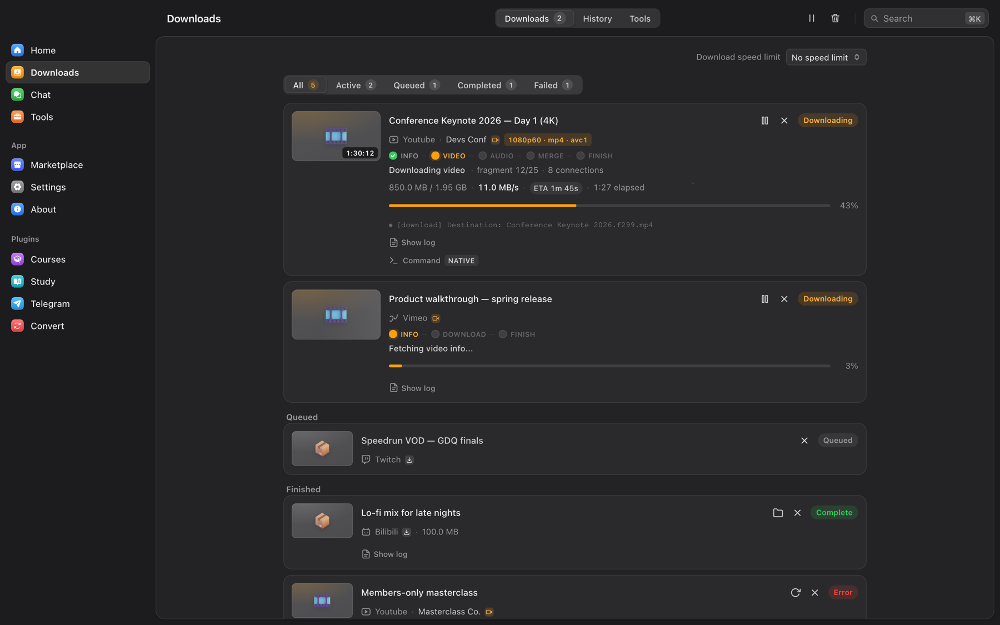
</p>

### Pule a janela

Copie um link em qualquer lugar do sistema e aperte **Ctrl+Shift+D** (**Cmd+Shift+D** no macOS). O OmniGet lê a área de transferência e começa o download em segundo plano. Um segundo atalho, **Ctrl+Shift+M**, pega só o áudio, então um link do YouTube vira um MP3 sem abrir nada. Ele fica desligado até você ativar, e os dois atalhos podem ser trocados em **Configurações → Downloads → Área de transferência e atalhos**.

---

## O que o OmniGet baixa

O OmniGet tem extratores nativos para as plataformas que as pessoas mais usam e entrega o resto ao [yt-dlp](https://github.com/yt-dlp/yt-dlp), que cobre cerca de 1.800 sites.

| Categoria | Sites e formatos |
|---|---|
| Cursos online | Hotmart, Udemy, Kiwify, Rocketseat e Meta-Analysis Academy pelo plugin Courses. Todas as aulas, escolha de seções, anexos, continuar de onde parou. |
| Vídeo e áudio | YouTube (vídeos, playlists, canais, live desde o início, capítulos, SponsorBlock), Instagram, TikTok, X/Twitter, Reddit, Twitch (VODs, clipes, ao vivo), Vimeo, Bluesky, Threads, Pinterest, Douyin |
| Bilibili, logado | 4K, HDR, Dolby Vision, Hi-Res sem perdas e Dolby Atmos conforme sua assinatura. Danmaku em XML, ASS ou JSON, arquivos NFO para Kodi e Jellyfin, modelos de nome, 11 tipos de URL incluindo bangumi, cursos, favoritos, assistir depois e histórico |
| Galerias de imagens | Galerias e perfis inteiros de mais de 250 sites via gallery-dl (DeviantArt, Pixiv, ArtStation, Flickr, Tumblr, Imgur, Kemono e outros) |
| Em lote | Cole vários links ou carregue um `.txt`, baixe subreddits inteiros, perfis do Reddit e do X, perfis do Instagram e do Pinterest |
| Arquivos e transferência | Arquivos `.torrent` e magnets com cliente BitTorrent embutido, arquivos HTTP diretos, manifestos HLS e DASH, e transferência direta entre duas instalações do OmniGet com um código curto de palavras |
| Telegram | Fotos, vídeos, arquivos e áudios de qualquer canal ou grupo em que você esteja, pelo plugin Telegram |

Opções que você define uma vez e esquece: qualidade padrão, formato de áudio (MP3, M4A, Opus, FLAC ou WAV), idiomas e formato de legenda (SRT, VTT, ASS, embutida ou ao lado), thumbnail e metadados embutidos, modelo de nome de arquivo, organizar por plataforma, pular arquivos existentes, dividir por capítulos, limite de velocidade, downloads simultâneos, proxy. Regras mandam um canal ou host para a pasta e a qualidade que você escolher sem perguntar de novo. Canais seguidos são verificados em segundo plano e podem baixar novos vídeos automaticamente, com notificação na bandeja.

<p align="center">
  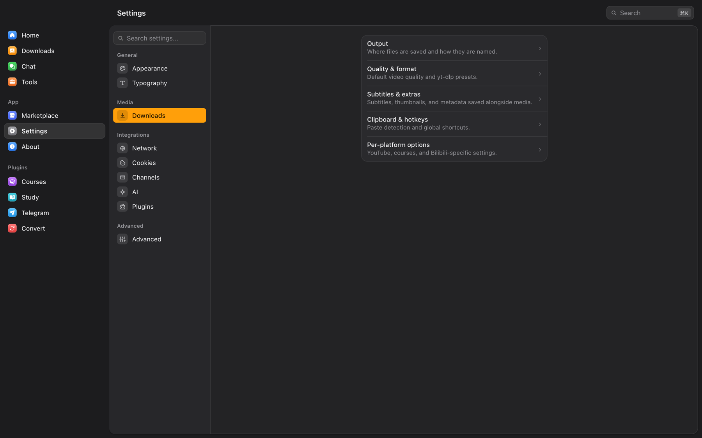
</p>

---

## A extensão do navegador, passo a passo

A extensão faz dois trabalhos. Em sites que ela reconhece (YouTube, Instagram, TikTok, X, Reddit, Twitch, Pinterest, Bluesky, Telegram, Vimeo, Udemy, Hotmart, Rocketseat, Bilibili, SoundCloud) ela manda a página para o OmniGet com um clique ou com **Alt+O**. Em qualquer outro site ela observa o tráfego de rede em busca de streams MP4, HLS, DASH, WebM e áudio e lista tudo no popup. Nos dois casos ela envia seus cookies e o referer, e é isso que permite ao OmniGet baixar conteúdo privado em que você está logado, como stories do Instagram, um curso pago ou um vídeo só para membros. Os cookies são agrupados pelo site de verdade, então um domínio `.com.br` ganha a própria entrada em vez de dividir uma com todos os outros `.com.br`. O popup também tem um interruptor **Forçar H.264** para o YouTube, para computadores que engasgam com VP9 e AV1.

Escolha o nível que combina com o seu conforto.

<p align="center">
  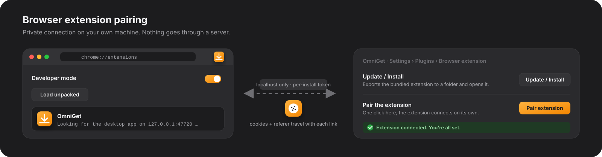
</p>

### Nível 1: de dentro do app (sem downloads, sem zip)

1. Abra o OmniGet, instalando se ainda não instalou. Abra pelo menos uma vez.
2. Vá em **Configurações → Plugins → Extensão do navegador**. Clique em **Atualizar / Instalar** ao lado de Chrome. O OmniGet copia a extensão que vem dentro dele para uma pasta e abre essa pasta para você.
3. Abra o Chrome (Edge, Brave e outros navegadores Chromium funcionam igual) e digite `chrome://extensions` na barra de endereço.
4. Ative o **Modo do desenvolvedor** no interruptor do canto superior direito.
5. Clique em **Carregar sem compactação** e escolha a pasta que o OmniGet acabou de abrir.
6. O ícone do OmniGet aparece na barra de ferramentas. Uma página de opções abre sozinha dizendo que está procurando o app.
7. De volta ao OmniGet, ainda em **Configurações → Plugins → Extensão do navegador**, clique em **Parear extensão**. Em poucos segundos o app diz "Extensão conectada" e a página de opções fica verde. Pronto.

Daí em diante, entre em qualquer página suportada e clique no ícone. A página, os cookies e o título vão para o OmniGet e o download começa. Seus cookies também aparecem em **Configurações → Cookies**, onde o plugin Courses e as ferramentas de Instagram, X e Pinterest os reaproveitam.

### Nível 2: pelo zip da release

Toda release traz o `omniget-chrome-extension-vX.Y.Z.zip`. Baixe da [última release](https://github.com/tonhowtf/omniget/releases/latest), descompacte e siga os passos 3 a 7 acima apontando **Carregar sem compactação** para a pasta descompactada. Use isso se o app fica numa máquina e o navegador em outra, ou se está instalando para outra pessoa.

### Nível 3: Firefox, outros navegadores e pareamento manual

Firefox: **Configurações → Plugins → Extensão do navegador → Atualizar / Instalar** ao lado de Firefox, depois abra `about:debugging#/runtime/this-firefox`, clique em **Carregar extensão temporária** e escolha o `manifest.json` na pasta exportada. O Firefox descarta extensões temporárias ao reiniciar, então repita até a extensão ser publicada no AMO. Safari ainda não é suportado porque extensões do Safari precisam passar pela App Store.

Pareamento manual: se **Parear extensão** expirar, abra a página de opções da extensão (botão direito no ícone → Opções), depois no OmniGet revele e copie o **Token de pareamento** e cole na página de opções. A URL do endpoint é detectada sozinha. O app escuta em `127.0.0.1`, portas 47720 a 47729, e o token é gerado por instalação, então nada sai da sua máquina.

Se a extensão está instalada mas o OmniGet está fechado, os cliques caem no esquema de link `omniget://`, que ainda enfileira a URL mas não consegue levar cookies. Marque "Sempre permitir" na primeira vez que o Chrome perguntar.

---

## A seção Tools: 108 ferramentas em 16 categorias

Tools é a parte do OmniGet que cresceu além de baixar. Cada quadrado é um trabalho: um comando Rust isolado com JSON entrando e JSON saindo, o que também é o que permite a agentes de IA acionarem as ferramentas pelo servidor MCP embutido. O hub tem uma busca que entende inglês e português ("legenda" acha as ferramentas de subtitle) e um filtro de plataforma, e ferramentas que só rodam no Windows avisam isso no quadrado e ficam ocultas nos outros sistemas.

<p align="center">
  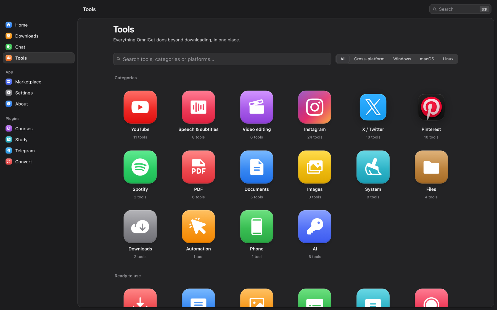
</p>

Legenda de status: sem marca significa pronta, **beta** significa que funciona mas não foi testada com todo tipo de conta, **planejada** significa que o quadrado existe para você ver para onde as coisas vão e ainda não faz nada.

<table>
  <tr>
    <td>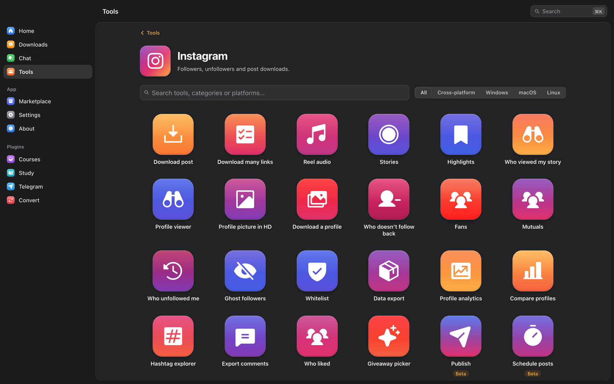</td>
    <td>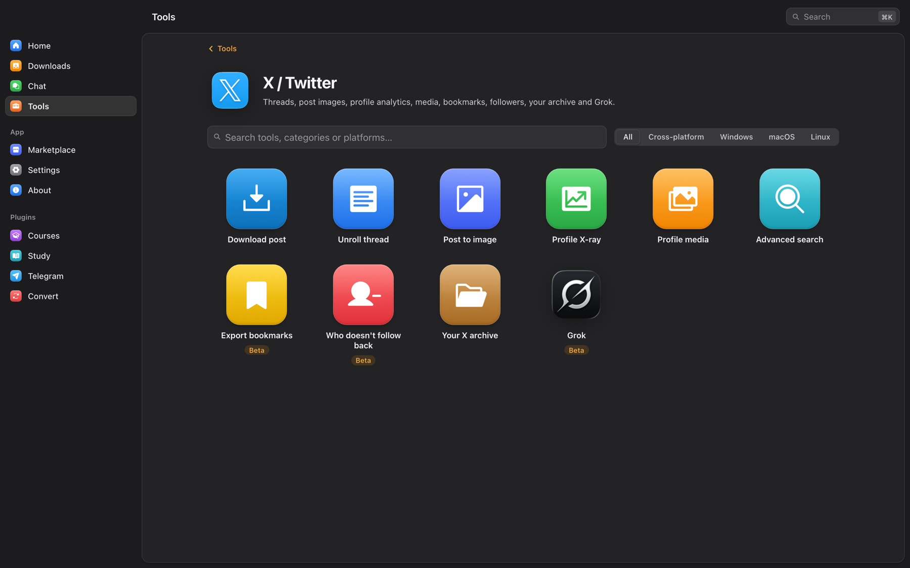</td>
  </tr>
  <tr>
    <td>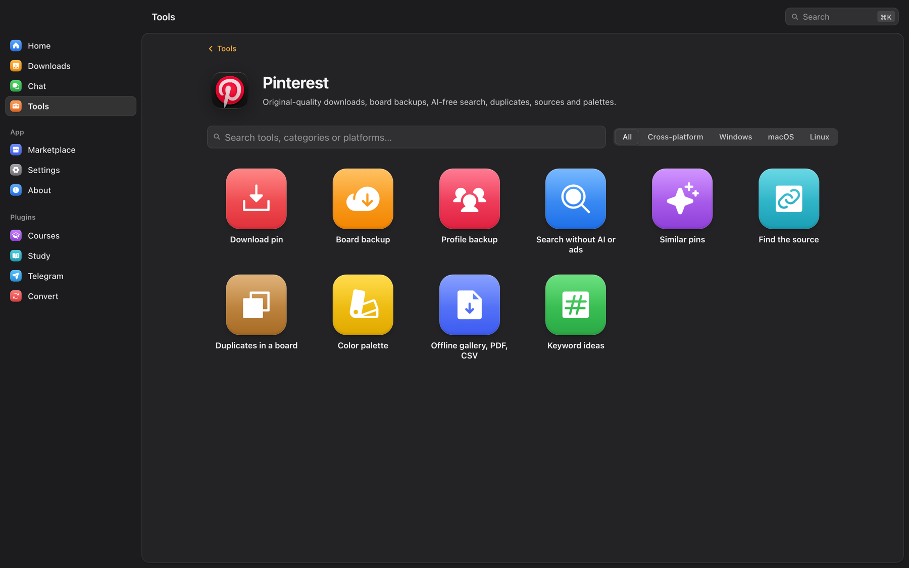</td>
    <td>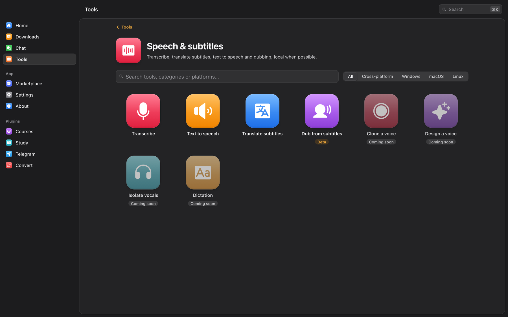</td>
  </tr>
</table>

### YouTube (11)

- **Baixar vídeo.** Cole um link e escolha qualidade, formato e legendas. O mesmo motor da tela inicial.
- **Metadados.** Salve informações, descrição e thumbnail sem o vídeo.
- **Thumbnails.** Veja todas as capas e salve em qualquer resolução.
- **Legendas.** Baixe legendas, ou junte dois idiomas em um arquivo bilíngue.
- **Comentários e capítulos.** Busque comentários ou marcadores de capítulo, filtre, exporte em JSON ou CSV.
- **Chat da live.** Salve o replay do chat de uma live em JSON ou CSV.
- **Oficina de legendas.** Edite, traduza e ressincronize arquivos SRT, VTT e ASS com forma de onda, sincronização por dois pontos, localizar e substituir, correção automática, e gramática e tradução por IA.
- **SponsorBlock.** Veja os trechos de patrocínio, intro e encerramento e receba as flags do yt-dlp para pular.
- **Dislikes.** Likes, dislikes e nota do Return YouTube Dislike.
- **Thumbnail real.** Os frames que a CDN já tem em 25, 50 e 75 por cento, em vez da capa clickbait.
- **Forçar H.264.** Um interruptor na extensão do navegador que mantém o YouTube em H.264 em vez de VP9 e AV1, para máquinas que engasgam com codecs novos.

### Fala e legendas (8)

- **Transcrever.** Áudio ou vídeo para legendas com whisper.cpp, offline. Modelos baixam sob demanda, aceleração Metal no macOS.
- **Texto para fala.** Vozes naturais do Microsoft Edge, grátis, com arquivo de legenda sincronizado.
- **Traduzir legendas.** Traduza um SRT com seu provedor de IA ou um servidor LibreTranslate, mantendo os tempos.
- **Dublar a partir de legendas.** Transforme um SRT numa faixa de voz que cabe em cada linha e, se quiser, substitua o áudio do vídeo. *beta*
- **Clonar voz**, **Criar voz** e **Isolar vocais** por uma instalação do VoiceStudio na sua máquina. *beta*
- **Ditado.** Aperte um atalho global, fale, e o whisper digita o texto onde o cursor está. *beta*

### Edição de vídeo (6)

- **Cortar trecho.** Escolha um vídeo no disco e corte um pedaço. O resultado cai na fila de downloads.
- **Converter.** Troque contêiner, codec ou resolução, ou comprima, pelo plugin Convert.
- **Legendas automáticas** e **Texto para fala** abrem as ferramentas de fala acima.
- **Gravar tela.** Tela e áudio do sistema pelo FFmpeg, com um buffer de replay que salva o que acabou de acontecer. *beta*
- **Editor de linha do tempo.** *planejada*

### Instagram (24)

Todas rodam na sua própria sessão do Instagram capturada pela extensão, então stories, melhores amigos e as suas listas funcionam. Leituras são espaçadas e ações de escrita param ao primeiro sinal de limite.

- **Baixar post.** Foto, vídeo, reel, IGTV ou carrossel de um link, na melhor qualidade.
- **Baixar vários links.** Cole uma lista ou um `.txt` e receba tudo.
- **Áudio do reel.** Só o som, em M4A ou MP3.
- **Stories.** Baixe stories, inclusive de melhores amigos, sem marcar como vistos.
- **Destaques.** Um destaque ou todos os destaques de um perfil.
- **Quem viu meu story.** Liste e exporte quem viu cada story ativo.
- **Ver perfil.** Bio, contagens, foto em HD e se a conta segue você.
- **Foto de perfil em HD.**
- **Baixar perfil.** Todos os posts, reels, marcados ou salvos, com o limite que você escolher.
- **Quem não segue de volta.** Compare seguidores e seguindo, proteja contas com uma lista branca, deixe de seguir num ritmo seguro.
- **Fãs.** Contas que seguem você mas você não segue, com opção de remover.
- **Mútuos.**
- **Quem deixou de seguir.** Fotografias das suas listas ao longo do tempo mostram quem saiu e quem chegou.
- **Seguidores fantasmas.** Seguidores que nunca curtem nem comentam, e os que mais interagem.
- **Lista branca.** Contas que nunca são sugeridas para deixar de seguir.
- **Exportar dados.** Leia offline o zip "Baixar suas informações" da Meta: pedidos pendentes, melhores amigos, bloqueados e mais.
- **Análise de perfil.** Taxa de engajamento, cadência, melhores dias e horários, hashtags e top posts de qualquer perfil público.
- **Comparar perfis.** Até seis perfis lado a lado.
- **Explorar hashtag.** Quantidade de posts, recentes e top, hashtags relacionadas, download.
- **Exportar comentários.** Todos os comentários de um post em CSV, com filtro.
- **Quem curtiu.** Liste e exporte as contas que curtiram um post.
- **Sorteio.** Sorteie vencedores entre os comentários com regras de menções, palavra-chave e uma participação por pessoa.
- **Publicar.** Foto, carrossel, reel, vídeo ou story pela sua sessão ou pela Graph API oficial. *beta*
- **Agendar posts.** Deixe posts na fila para data e hora. O OmniGet publica enquanto estiver aberto. *beta*

### X / Twitter (10)

Dados públicos vêm pela API do FxTwitter sem login. Tudo que é privado (bookmarks, seus seguidos, Grok no X) usa a sua sessão do X guardada no gerenciador de cookies.

- **Baixar post.** Vídeos, imagens e GIFs de qualquer post.
- **Desenrolar thread.** A thread inteira numa página, exportada em Markdown, HTML ou texto.
- **Post em imagem.** Um card PNG limpo de um post para compartilhar em qualquer lugar.
- **Raio-X do perfil.** Engajamento, melhor horário para postar, top posts e hashtags de qualquer conta.
- **Mídia do perfil.** Todas as fotos e vídeos de um perfil, em qualidade original, de uma vez.
- **Busca avançada.** Monte consultas com os operadores do X, veja tendências, exporte resultados.
- **Exportar bookmarks.** Todos os bookmarks com pastas, em JSON, CSV, Markdown ou HTML. *beta*
- **Quem não segue de volta.** Audite seguindo vs. seguidores e deixe de seguir com segurança usando uma lista branca. *beta*
- **Seu arquivo do X.** Abra offline o zip de dados: estatísticas, top posts, curtidas e listas de seguidores.
- **Grok.** Pergunte ao Grok com busca ao vivo no X ou resuma uma thread, pela API da xAI ou pela sua sessão do X. *beta*

### Pinterest (10)

Funciona sem login para tudo que é público. Cookies só são necessários para boards secretos e para desfazer salvamentos.

- **Baixar pin.** Imagem em qualidade original, vídeo em MP4, GIF, carrossel ou páginas de story.
- **Backup de board.** Todos os pins de um board ou seção com originais, vídeos, CSV/JSON e sincronização incremental.
- **Backup de perfil.** Todos os boards públicos de um perfil, uma pasta por board, mais os pins criados.
- **Busca sem IA nem anúncios.** Filtros que escondem imagens de IA, pins promovidos e vídeos, e então baixe.
- **Pins parecidos.** O "Mais ideias" de qualquer pin, filtrável e baixável.
- **Achar a fonte.** Link de destino, criador, verificação de link morto, Wayback Machine e busca reversa de imagem.
- **Duplicados num board.** Pins idênticos e quase idênticos, com opção de remover dos salvos.
- **Paleta de cores.** Paleta de um board ou pin em hex, CSS ou JSON.
- **Galeria offline, PDF, CSV.** Um board como galeria HTML pesquisável, moodboard em PDF ou planilha.
- **Ideias de palavras-chave.** Sugestões de busca, refinamentos e as palavras que os top pins usam.

### Spotify (2)

- **Temas e cores.** Personalize o cliente do Spotify com temas do Spicetify. *beta*
- **Extensões.** Instale extensões e apps do Marketplace do Spicetify. *beta*

### PDF (6)

- **Juntar.** Una vários PDFs em um, na ordem que quiser.
- **Dividir.** Extraia páginas ou quebre um PDF em partes.
- **Comprimir.** Reduza o tamanho de um PDF mantendo a leitura.
- **Converter.** PDF para imagens ou Word, e de volta.
- **OCR.** Torne PDFs escaneados pesquisáveis. *beta*
- **PDF seguro.** Reconstrua um PDF a partir de pixels para remover scripts e formulários.

### Documentos (5)

- **SlideShare para PDF.** Todos os slides no maior tamanho, montados em um PDF.
- **Exportar Google Docs.** Docs, Slides e Sheets públicos em PDF, DOCX, PPTX ou XLSX.
- **Páginas do Calameo.** Salve as páginas de uma publicação do Calameo em SVG ou JPG. *beta*
- **Galerias de imagens.** Galerias e perfis inteiros de mais de 250 sites com gallery-dl.
- **Scribd.** Salve livros legíveis em PDF usando a sua própria sessão. *planejada*

### Imagens (3)

- **Upscale.** Real-ESRGAN em qualquer GPU Vulkan, 2x, 3x ou 4x. *beta*
- **Redimensionar imagens.** Em lote por largura, altura, encaixe ou porcentagem, convertendo o formato se quiser.
- **OCR.** Copie o texto de imagens e slides. *beta*

### Arquivos (4)

- **Duplicados.** Encontre arquivos idênticos por hash e libere espaço com segurança.
- **Renomear em lote.** Regex, contadores e troca de caixa com prévia antes de aplicar.
- **Encontrar arquivos.** Busca instantânea com Everything no Windows, Spotlight no macOS ou fd no Linux.
- **Manter acordado.** Impeça o computador de dormir durante trabalhos longos.

### Downloads (2)

- **Download acelerado.** Arquivos grandes com 16 conexões, retomada e checksum via aria2.
- **Manifesto HLS / DASH.** Cole um `.m3u8` ou `.mpd` com Referer e cookie. O FFmpeg salva um MP4.

### Celular (1)

- **Enviar para o celular.** Arquivos, links e texto para um dispositivo KDE Connect pareado.

### Sistema (9, itens só para Windows marcados)

- **Limpar caches.** Temporários, logs e caches de apps com regras por sistema. Você revisa a lista antes de qualquer coisa ser apagada.
- **Analisador de disco.** O que ocupa espaço, em treemap e na lista dos maiores arquivos, com botão de mandar para a lixeira.
- **Gerenciador de inicialização.** Veja o que abre com o sistema e desligue itens. *beta*
- **Desinstalador.** Remova apps e as sobras que eles deixam. *beta*
- **Escudo de privacidade.** Controle telemetria, ID de anúncios e rastreamento do Windows. Windows. *beta*
- **Endurecer o Windows.** Macros, AutoRun, host de scripts, UAC e Defender conforme o hardentools, reversível. Windows. *beta*
- **Debloat do Windows.** Remova apps da Store que vêm pré-instalados. Windows. *beta*
- **Limpador de registro.** Entradas órfãs, com backup `.reg` antes de remover. Windows. *beta*
- **Atualizador de programas.** Atualize programas em lote via winget, Chocolatey e Scoop. Windows. *beta*

### Automação (1)

- **Auto clicker.** Clique na velocidade exata que você definir, com atalho global, limites e intervalos aleatórios. Windows, macOS e Linux. *beta*

### IA (6)

- **Comparar preços.** O custo do mesmo modelo em vários provedores, com preços do LiteLLM e do models.dev.
- **Gastos com IA.** Quanto o OmniGet gastou com IA, por dia, modelo e tarefa, a partir de um registro local.
- **Modelos locais (Ollama).** Veja, baixe e remova modelos locais e use-os como provedor gratuito.
- **Humanizar texto.** Reescreva texto com cara de IA para soar como uma pessoa, sem mudar o que diz. Roda no provedor de IA configurado. *beta*
- **Chaves de API.** Um cofre local para chaves e contas, com teste de conexão, saldo de OpenRouter, DeepSeek, SiliconFlow e New API, e exportação para Claude Code, Codex, Cherry Studio, opencode ou um arquivo `.env`.
- **Servidor MCP.** As ferramentas do OmniGet expostas pelo Model Context Protocol na ponte local, 31 ferramentas atrás do mesmo token da extensão, com trechos de configuração prontos para Claude Code, Claude Desktop, Cursor, VS Code, Goose e Codex. *beta*

Toda ferramenta que fala com uma IA usa o provedor definido em **Configurações → IA**: OpenAI, Anthropic, ou qualquer endpoint local compatível com OpenAI, como Ollama ou LM Studio. A chave fica guardada localmente e nunca vai para log. Auto clicker, ditado e buffer de replay podem receber, cada um, um atalho global próprio.

---

## Plugins: Courses, Study, Telegram, Convert

Plugins são bibliotecas Rust separadas, carregadas na inicialização. O OmniGet instala o conjunto oficial na primeira abertura e atualiza sozinho. A página Marketplace mostra o que está instalado, o que cada plugin pode fazer (eventos, notificações, configurações, pastas de download, proxy, ferramentas gerenciadas, fila de downloads), e permite ocultar, desativar ou desinstalar qualquer um.

<p align="center">
  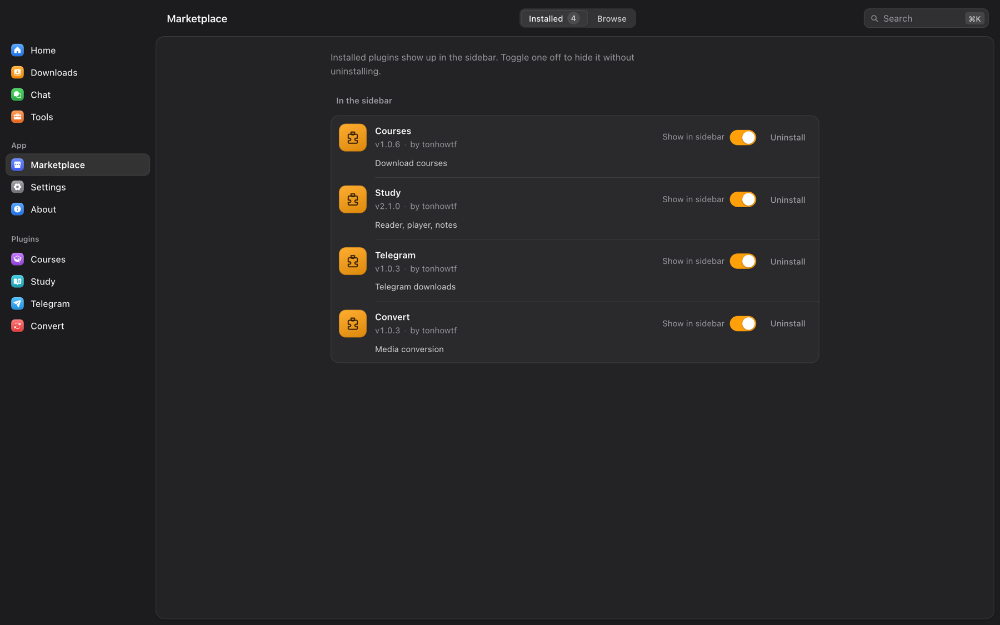
</p>

### Courses

Entre na **Hotmart**, **Udemy**, **Kiwify**, **Rocketseat** ou **Meta-Analysis Academy** por uma janela de navegador dentro do app, com cookies salvos pela extensão, ou com e-mail e senha onde a plataforma permite. O OmniGet lista suas compras, abre o sumário do curso para você marcar as seções que quer (avisando quantas aulas têm DRM e serão puladas) e baixa todas as aulas e anexos, com numeração contínua se quiser. A Hotmart usa o fluxo de login OIDC atual, então continua funcionando depois da mudança de autenticação de 2026, e cursos gratuitos e cursos entregues fora do Hotmart Club também aparecem na lista. Cursos baixados aparecem no Study automaticamente.

### Study

O Study transforma a pasta de arquivos que você baixou em algo que dá para terminar de verdade.

- Biblioteca e player. Aponte o Study para as pastas dos seus cursos (nada é copiado nem movido). O player retoma no segundo exato, e apertar **N** captura uma nota no tempo atual que volta para lá quando clicada.
- Leitor. PDF, EPUB, DJVU, MOBI, AZW3, FB2, CBZ, CBR, TXT, RTF e HTML, com marcações, favoritos, coleções, modo foco e um tema com jeito de papel. Capas, títulos e autores são extraídos dos arquivos.
- Notas. Editor Markdown e LaTeX com links entre páginas, diário, modelos, tags, grafo de conhecimento e exportação em `.md` ou PDF. Qualquer nota pode virar flashcard.
- Anki. Baralhos de repetição espaçada com importação de `.apkg`, `.txt` e CSV, baralhos filtrados, presets, tipos de nota, tags, mídia, estatísticas e histórico de revisões.
- Foco. Pomodoro e sessões de trabalho profundo com metas diárias e semanais que pausam o player ao terminar.
- Progresso e conquistas. Sequências, metas diárias, heatmap do ano e XP local sem ranking.
- Música. Sua biblioteca local com capas, artistas e álbuns, letras sincronizadas, favoritos, histórico, playlists, gêneros, transcodificação e navegadores de Spotify, SoundCloud e YouTube Music, para playlists e curtidas ficarem ao lado dos seus arquivos.

### Telegram

Entre com QR code ou número de telefone. Navegue por todos os canais e grupos em que está, filtre por foto, vídeo, documento ou áudio, busque arquivos e baixe um item ou o chat inteiro com lista de progresso. Vídeos de canais podem ser importados direto para a biblioteca do Study.

### Convert

Conversões com FFmpeg e aceleração por GPU quando a máquina tem: contêiner, codec, resolução, bitrate e compressão de vídeo e áudio, sem internet.

---

## Chat embutido, desligado por padrão

O OmniGet traz um chat no estilo Discord chamado OmniDisc para servidores que você mesmo hospeda com o [omnidisc-server](https://github.com/tonhowtf/omnidisc-server). Canais de texto, mensagens diretas, amigos, cargos e permissões, fixados, busca, voz, vídeo e compartilhamento de tela. Mensagens diretas e os arquivos enviados nelas são criptografados de ponta a ponta com MLS, e a chave de uma chamada criptografada deriva do mesmo grupo, então quem opera o servidor não consegue ouvir. A voz roda em Rust em vez de no webview e o compartilhamento de tela usa o codificador de hardware da máquina. Arquivos enviados pelo chat ficam criptografados em repouso e são apagados do servidor depois de trinta minutos.

É experimental e não faz nada até você ativar em **Configurações → Avançado → Chat (OmniDisc)** e adicionar um servidor.

---

## Para quem joga League of Legends

Um menu League fica na barra lateral. Ele lê o cliente do League em execução, localmente, sem conta e sem site de builds de terceiros, e não faz nada enquanto o cliente não está aberto. Se você não joga, desligue em **Configurações → Avançado → League of Legends** e o menu some.

Scouting da partida para os dois times com elo, forma recente, KDA e os campeões que cada jogador realmente joga. Probabilidade de vitória que encolhe as taxas de vitória em direção à média conforme o tamanho da amostra e sempre mostra uma faixa. Ouro, CS e nível ao vivo dos dez jogadores. Metas por função que você pode editar. Runas e feitiços recomendados pelo próprio cliente, aplicados em um clique e substituindo apenas a página que o OmniGet criou. Tiers de campeões por função. Busca de jogador por Riot ID. Automação opcional: aceitar partidas, escolher e banir pela sua lista de prioridade, pegar um campeão do banco do ARAM. Cada automação tem o seu próprio interruptor.

Novidades marcadas como beta ou experimentais: uma aba **Perfil** que edita o que os outros jogadores veem (elo exibido no chat, medalhas e título de desafio, banner e brasão, ícone do chat, gestão de amigos em massa); uma **roleta de skin, chroma e ward** que sorteia uma skin sua no momento do lock-in, com re-sorteio; um **sorteio de campeão e de rota** para quando você quer que a fila decida, mais um pick aleatório opcional na seleção de campeões; **histórico completo e ranked de qualquer jogador** pelo gateway do próprio cliente com o backend, com download de replay; e um **coach de IA** que revisa uma partida, aponta tendências das suas últimas partidas ou responde a uma pergunta sobre a seleção atual, usando o provedor de IA configurado e os dados públicos do OP.GG.

---

## Tudo o mais que vem na caixa

- Paleta de comandos (**Ctrl+K** ou **Cmd+K**) que pula para qualquer página, configuração ou ferramenta.
- Detecção de área de transferência que oferece baixar um link copiado com um clique num toast.
- Gerenciador de cookies que guarda sessões por site, capturadas pela extensão ou importadas de um `cookies.txt`, com botão de teste por domínio.
- Resumos de vídeo: cole uma URL em **Configurações → IA**, o OmniGet busca as legendas e resume no tamanho e idioma que você escolher.
- Enviar um arquivo para alguém: escolha o arquivo, compartilhe o código de palavras, a outra pessoa cola no OmniGet dela.
- Discord Rich Presence mostrando o que você está ouvindo, assistindo ou lendo. Downloads ficam privados.
- Ícone na bandeja, iniciar com o sistema, iniciar minimizado, impedir suspensão durante downloads.
- Todo download guarda o comando yt-dlp exato que rodou. Abra, mude uma flag, tente de novo.
- 14 temas, incluindo Catppuccin (quatro sabores), Dracula, One Dark Pro, três variantes e-ink e três variantes Nyxvamp.
- 11 idiomas: inglês, português, espanhol, francês, italiano, grego, russo, japonês, persa, chinês simplificado e tradicional.
- Roda em Windows, macOS (Apple Silicon e Intel) e Linux (x86_64 e ARM64).

---

## Privacidade e o que o OmniGet se recusa a fazer

Tudo roda no seu computador. Não há conta, não há servidor nosso no meio e não há telemetria do que você baixa. Cookies e chaves de API ficam no seu perfil local. As únicas chamadas de rede que o OmniGet faz por conta própria são para os sites que você pediu para baixar, para o GitHub buscar atualizações e plugins, e para o provedor de IA que você configurou, quando usa uma ferramenta de IA.

O OmniGet baixa o que a sua própria sessão logada já consegue abrir. Ele não burla DRM, não quebra paywalls e não compartilha credenciais, e aulas protegidas por DRM são puladas e informadas. Você é responsável por respeitar direitos autorais e os termos de serviço de cada plataforma. O texto completo está no app em **Sobre → Termos e ética**.

---

## Perguntas frequentes

**O OmniGet é grátis?**
Sim. GPL-3.0, sem plano pago, sem anúncios, sem conta.

**O OmniGet é uma interface para o yt-dlp?**
Em parte. O yt-dlp cuida da cauda longa de sites e o OmniGet o embute, verifica e atualiza. Em cima disso ficam extratores nativos para cursos, Instagram, X, Pinterest, Bilibili, Telegram e torrents, uma fila com retomada e repetição, a seção Tools e a biblioteca do Study.

**Dá para baixar um curso da Udemy ou da Hotmart que eu comprei?**
Sim. Instale o plugin Courses (já vem instalado), entre pelo app, escolha o curso e as seções e baixe. Aulas e anexos caem numa pasta por curso e aparecem no Study. Kiwify, Rocketseat e Meta-Analysis Academy funcionam do mesmo jeito.

**Dá para baixar stories, melhores amigos ou destaques do Instagram?**
Sim, usando a sua própria sessão capturada pela extensão. Stories são baixados sem marcar como vistos.

**Dá para baixar um vídeo do X, uma thread inteira ou toda a mídia de um perfil?**
Sim. Posts públicos não precisam de login. Bookmarks e as suas listas de seguidos precisam da sua sessão do X.

**Dá para fazer backup de um board do Pinterest em qualidade original?**
Sim, incluindo vídeos, seções, boards secretos com cookies e sincronização incremental para buscar só o que é novo.

**Ele retoma downloads interrompidos?**
Sim. Arquivos parciais são mantidos e continuados, e limites de requisição disparam repetições com backoff.

**Quais formatos ele salva?**
Vídeo em MP4, MKV ou WebM. Áudio em MP3, M4A, Opus, FLAC ou WAV. Legendas em SRT, VTT ou ASS, embutidas ou ao lado do arquivo.

**Precisa de Python, Node ou terminal?**
Não. Baixe o app, abra, cole um link. O único passo no terminal é o do Gatekeeper do macOS acima, uma vez só.

**O macOS diz que o app está danificado.**
Rode os dois comandos da [seção da primeira abertura](#o-aviso-da-primeira-abertura-e-como-resolver). Acontece porque o app não é notarizado, e acontece uma vez.

**Dá para transcrever um vídeo em legendas offline?**
Sim. Tools → Fala e legendas → Transcrever usa o whisper.cpp localmente. Os modelos baixam sob demanda.

**Dá para rodar de um pendrive?**
Sim, no Windows, com um arquivo `portable.txt` ao lado do executável.

**Qual pacote de Linux eu escolho?**
Debian e Ubuntu: `.deb`. Fedora, openSUSE, família RHEL: `.rpm`. Qualquer outro: `.AppImage`. x86_64 e ARM64 são publicados. O OmniGet não está no Flathub.

---

## Linha de comando

O `omniget-cli` sai com toda release para Windows, macOS (Intel e Apple Silicon) e Linux. Pegue o `omniget-cli-<versão>-<alvo>` na [última release](https://github.com/tonhowtf/omniget/releases/latest).

```bash
omniget info <url>                     # título, formatos e tamanho, sem baixar nada
omniget download <url> -q 1080 -o ~/Videos
omniget download <url> --audio-only --subs en,pt
omniget batch links.txt -m 3           # uma URL por linha, 3 por vez
omniget import-cookies cookies.txt     # formato Netscape
```

---

## Compilar do código-fonte

Se você só quer usar o OmniGet, [pegue uma release](#baixar-e-instalar). Para compilar você precisa de [Rust](https://rustup.rs/) (a toolchain exata está fixada em `rust-toolchain.toml` porque a ABI dos plugins depende dela), [Node.js](https://nodejs.org/) 18+ e [pnpm](https://pnpm.io/).

```bash
git clone https://github.com/tonhowtf/omniget.git
cd omniget
pnpm install
pnpm tauri dev
```

<details>
<summary>Dependências de build no Linux</summary>

```bash
sudo apt-get install -y libwebkit2gtk-4.1-dev build-essential curl wget file libxdo-dev libssl-dev \
  libayatana-appindicator3-dev librsvg2-dev patchelf libasound2-dev libpipewire-0.3-dev clang libclang-dev
```

</details>

Build de produção:

```bash
pnpm tauri build --config '{"bundle":{"createUpdaterArtifacts":false}}'
```

As releases assinam os artefatos do atualizador com uma chave privada que só o mantenedor tem, então um `pnpm tauri build` puro para com "A public key has been found, but no private key". A flag acima desliga esses artefatos numa build local e não muda mais nada.

Os plugins ficam em repositórios próprios: [omniget-plugin-courses](https://github.com/tonhowtf/omniget-plugin-courses), [omniget-plugin-telegram](https://github.com/tonhowtf/omniget-plugin-telegram), [omniget-plugin-convert](https://github.com/tonhowtf/omniget-plugin-convert) e [omniget-study-release](https://github.com/tonhowtf/omniget-study-release). O registro é o [omniget-plugins](https://github.com/tonhowtf/omniget-plugins). `pnpm plugins:deploy` compila os checkouts vizinhos dos plugins e copia para a sua pasta de dados local.

Stack: Tauri 2, Rust, SvelteKit com Svelte 5, SQLite, yt-dlp, FFmpeg, librqbit para torrents, whisper.cpp, aria2, gallery-dl.

---

## Contribuir e traduzir

Relatos de bug e pull requests vão para [Issues](https://github.com/tonhowtf/omniget/issues) e [Pull requests](https://github.com/tonhowtf/omniget/pulls). Perguntas e ajuda rápida ficam no [Discord](https://discord.gg/jgdxyPy7Vn).

As traduções são feitas no [Weblate](https://hosted.weblate.org/engage/omniget/). Escolha o seu idioma e traduza pelo navegador. Novas strings aparecem lá algumas horas depois de entrarem na `main`.

O OmniGet é construído sobre [yt-dlp](https://github.com/yt-dlp/yt-dlp), [FFmpeg](https://ffmpeg.org/), [gallery-dl](https://github.com/mikf/gallery-dl), [whisper.cpp](https://github.com/ggerganov/whisper.cpp), [aria2](https://aria2.github.io/), [SponsorBlock](https://sponsor.ajay.app/), [Return YouTube Dislike](https://returnyoutubedislike.com/), [FxTwitter](https://github.com/FixTweet/FxTwitter), [Spicetify](https://spicetify.app/) e [Tauri](https://tauri.app/). Obrigado a todo mundo que os mantém.

O Loop, a criatura da tela inicial, é o mascote do OmniGet. Fan art é bem-vinda. A arte original não pode ser usada comercialmente nem redistribuída modificada.

<p align="center">
  <a href="https://star-history.com/#tonhowtf/omniget&Date"></a>
</p>

<p align="center">
  <a href="https://github.com/tonhowtf/omniget/releases/latest"><b>Baixar o OmniGet</b></a> · <a href="LICENSE">GPL-3.0</a>
</p>
