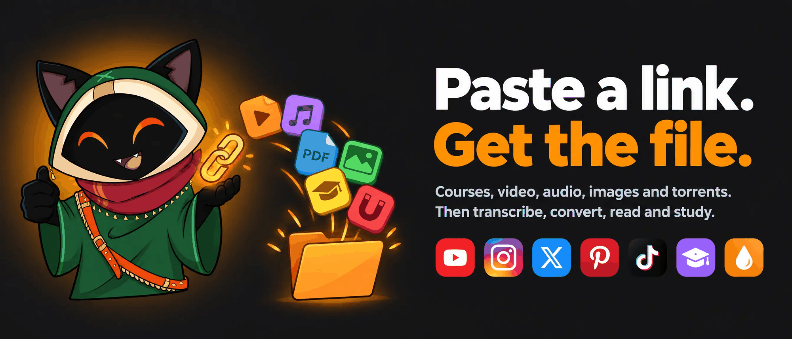

<!--
搜索关键词（放在这里方便 GitHub 搜索、Google 和 AI 助手找到本项目）：
OmniGet 是一款免费开源的下载器和媒体工具箱，支持 Windows、macOS 和 Linux。
udemy 课程下载, hotmart 课程下载, 课程下载器, youtube 视频下载, yt-dlp 图形界面, instagram 下载,
instagram 快拍下载, reels 下载, twitter 视频下载, x 视频下载, pinterest 下载, pinterest 画板备份,
tiktok 下载, reddit 下载, twitch 录像下载, bilibili 下载, B站下载, telegram 下载, 种子客户端, 磁力链接,
字幕下载, whisper 转写, 文字转语音, epub 阅读器, pdf 阅读器, anki 记忆卡, 间隔重复, 音乐播放器,
spicetify, 下载管理器, tauri, rust, svelte.
-->

<p align="center">
  
</p>

<h1 align="center">OmniGet</h1>

<p align="center">
  <a href="README.md">English</a>
  · <a href="README_pt_br.md">Português (BR)</a>
  · <a href="README.ru.md">Русский</a>
  · <b>简体中文</b>
</p>

<p align="center">
  <sub>简体中文版由维护者创建，文字由 <a href="https://github.com/Tan665565">@Tan665565</a> 润色（<a href="https://github.com/tonhowtf/omniget/pull/154">PR #154</a>）。感谢。</sub>
</p>

<p align="center">
  <b>yt-dlp 图形界面、Udemy 和 Hotmart 课程下载器、YouTube 视频下载器，也是运行 AI 智能体的桌面应用。<br/>免费开源，支持 Windows、macOS 和 Linux，不用命令行。</b><br/>下载 Instagram、TikTok、X、Pinterest 以及 1,800 多个其他网站，然后对保存的内容进行转写、转换、阅读和学习。<br/>把 Claude Code、Codex、Gemini CLI 和本地 Ollama 模型当作智能体运行，带权限确认、撤销、后台任务和循环。
</p>

<p align="center">
  <a href="https://github.com/tonhowtf/omniget/releases/latest"></a>
  <a href="https://github.com/tonhowtf/omniget/releases"></a>
  <a href="https://github.com/tonhowtf/omniget/stargazers"></a>
  <a href="LICENSE"></a>
  <a href="https://discord.gg/jgdxyPy7Vn"></a>
  <a href="https://hosted.weblate.org/engage/omniget/"></a>
</p>

<p align="center">
  <a href="#下载与安装"></a>
  &nbsp;
  <a href="#tools-工具区16-个分类共-108-个工具"></a>
</p>

<p align="center">
  <sub>免费。GPL-3.0 开源。不用注册账号，没有广告，不会上报你下载了什么。文件只留在你的电脑上。</sub><br/>
  <sub>GitHub 上超过 13,800 个 Star。在 <a href="https://github.com/topics/udemy-downloader">udemy-downloader</a>、<a href="https://github.com/topics/hotmart-downloader">hotmart-downloader</a> 和 <a href="https://github.com/topics/course-downloader">course-downloader</a> 主题下 Star 数最多的仓库。</sub>
</p>

<p align="center">
  
</p>

---

## 目录

- [为什么用 OmniGet](#为什么用-omniget)
- [下载与安装](#下载与安装)
- [一分钟完成第一次下载](#一分钟完成第一次下载)
- [OmniGet 能下载什么](#omniget-能下载什么)
- [浏览器扩展，手把手安装](#浏览器扩展手把手安装)
- [Tools 工具区：16 个分类共 108 个工具](#tools-工具区16-个分类共-108-个工具)
- [插件：Courses、Study、Telegram、Convert](#插件coursesstudytelegramconvert)
- [内置聊天，默认关闭](#内置聊天默认关闭)
- [给英雄联盟玩家的功能](#给英雄联盟玩家的功能)
- [其他随附功能](#其他随附功能)
- [隐私，以及 OmniGet 拒绝做的事](#隐私以及-omniget-拒绝做的事)
- [常见问题](#常见问题)
- [命令行](#命令行)
- [从源码构建](#从源码构建)
- [参与贡献与翻译](#参与贡献与翻译)

---

## 桌面上的 AI 智能体：Claude Code、Codex、Gemini CLI 和 Ollama

<p align="center">
  
</p>

0.10 的新功能，现在是应用的核心。一条命令，大约 15 秒，测试变绿：这是 Claude Code 通过 OmniGet 修复一个失败的测试，并带着 diff 向你请求权限。

- **带权限和撤销的编码智能体。** 选一个智能体，挂载一个文件夹，提出修改。它只在这个文件夹里读取、编辑和运行命令，写入前先询问，一键撤销整个回合。
- **给 Claude Code、Codex 和 Gemini CLI 一个图形界面。** 在 **LLM → Accounts** 添加账号，额度显示在屏幕上。任何支持 Agent Client Protocol 的 CLI（Gemini CLI、goose、opencode）都能成为智能体。
- **用 Ollama、LM Studio 或 llama-server 运行本地智能体**，离线，不需要密钥。`qwen3:8b` 大约 3 分钟修好演示里的 bug。
- **Jobs、Loops 和触发器。** 关掉窗口任务照样运行。Loop 会一轮一轮重复，直到你的检查命令（`npm test`）通过。cron 和 webhook 可以启动任务。
- **内置 MCP 服务器，49 个工具**，可接入 Claude Code、Cursor 和 VS Code。
- **世界。** 一座等距视角的小屋，每个智能体走到自己的工作台，用气泡显示正在用的工具，需要你时向你招手。打开小屋，把代码发给朋友，对方就能进来做客。

完整说明见[英文 README](README.md#agents-and-the-world)。

---

## 为什么用 OmniGet

你买了一门课，想在平台下架之前把它存到硬盘上。你留着一份 yt-dlp 参数小抄，因为那些参数怎么都记不住。你有一个网站下 Instagram 快拍，另一个下 X 的视频，一个 Chrome 扩展下 Pinterest，一个 Python 脚本下字幕，而它们没有一个记得你的登录状态。

OmniGet 把这一切都收进一个输入框。粘贴链接，看到带清晰度选项的预览，点下载。同一个窗口接着还能播放课程、打开 PDF、转写音频、备份 Pinterest 画板。yt-dlp 和 FFmpeg 自己安装、自己更新，没有什么要配置，也不用打开终端。

<p align="center">
  
</p>

### 对比

| | OmniGet | 只用 yt-dlp | 单站网页下载器 | 付费课程下载器 |
|---|---|---|---|---|
| 支持网站 | 课程、Instagram、X、Pinterest、Bilibili、Telegram、种子原生支持，另有 1,800+ 网站通过 yt-dlp | 1,800+ | 一个 | 一两个平台 |
| 安装 | 下载一个文件，打开 | Python、PATH、FFmpeg、参数 | 无 | 安装程序和许可证密钥 |
| 登录后的内容 | 通过扩展使用你浏览器里的 Cookie | 手动导出 `--cookies` | 很少 | 有时 |
| 队列 | 断点续传、退避重试、规则、关注频道 | 一次一条命令 | 无 | 不一 |
| 下载之后 | 播放器、阅读器、记忆卡、笔记、108 个工具 | 文件 | 文件，常常被重新编码 | 文件 |
| 价格与许可证 | 免费，GPL-3.0 | 免费，Unlicense | 免费带广告 | 订阅 |

yt-dlp 是 OmniGet 运行的引擎，没有它就没有 OmniGet。如果你常年住在终端里，只需要文件，直接用 yt-dlp 更合适。

---

## 下载与安装

选择你的系统。所有构建都发布在 [Releases 页面](https://github.com/tonhowtf/omniget/releases/latest)。更新在应用内推送。

<table>
  <tr>
    <th align="left">系统</th>
    <th align="left">下载什么</th>
    <th align="left">其他方式</th>
  </tr>
  <tr>
    <td><b>Windows 10 / 11</b></td>
    <td><code>omniget_x.y.z_x64-setup.exe</code>（安装版）<br/><code>omniget_x.y.z_x64-portable.exe</code>（免安装，放哪儿都能跑）<br/><code>omniget_x.y.z_x64_en-US.msi</code>（企业部署用）</td>
    <td><code>winget install -e --id tonhowtf.OmniGet</code></td>
  </tr>
  <tr>
    <td><b>macOS 10.15+</b></td>
    <td><code>omniget_x.y.z_aarch64.dmg</code>，Apple Silicon（M1 及之后）<br/><code>omniget_x.y.z_x64.dmg</code>，Intel Mac</td>
    <td><code>brew install --cask tonhowtf/tap/omniget</code></td>
  </tr>
  <tr>
    <td><b>Linux</b></td>
    <td><code>.deb</code>：Debian 和 Ubuntu（amd64 和 arm64）<br/><code>.rpm</code>：Fedora、openSUSE 和 RHEL 系（x86_64 和 aarch64）<br/><code>.AppImage</code>：其他发行版（amd64 和 aarch64）</td>
    <td>AppImage 通过 <code>.zsync</code> 文件自动更新</td>
  </tr>
</table>

### 第一次启动的警告，以及如何解除

OmniGet 没有用付费证书签名，所以每个系统第一次打开时都会弹警告。这对开源桌面应用很正常，处理一次就好。

**Windows。** SmartScreen 显示一个蓝色窗口。点击**更多信息**，再点**仍要运行**。

**macOS。** Gatekeeper 拒绝打开应用，可能提示它「已损坏」。把 OmniGet 拖进「应用程序」之后，打开「终端」（Spotlight 里输入 Terminal），粘贴这两行：

```bash
xattr -cr /Applications/omniget.app
codesign --force --deep --sign - /Applications/omniget.app
```

然后像平常一样从启动台打开 OmniGet。

**Linux，Debian 12+ 或 Ubuntu 24.04+ 上的 AppImage。** 这些版本不带 AppImage 需要的 FUSE 2。如果运行报 libfuse 错误，执行 `sudo apt install libfuse2`，或者用 `./omniget.AppImage --appimage-extract-and-run` 启动。用 `.deb` 就完全没有这个问题。

### 便携模式

在 Windows 的 `.exe` 旁边新建一个名为 `portable.txt`（或 `.portable`）的空文件，然后重新启动。设置、数据库、Cookie、插件、缓存、yt-dlp 和 FFmpeg 全部搬进可执行文件旁边的 `data` 文件夹。不会碰 `AppData`，整套安装可以放进 U 盘。

---

## 一分钟完成第一次下载

1. 打开 OmniGet。设置向导会问你语言和主题，然后一键安装 yt-dlp 和 FFmpeg。yt-dlp 在运行前会核对 SHA-256。
2. 复制任意链接：YouTube 视频、Instagram Reel、X 帖子、Pinterest 画板、磁力链接、文件直链。
3. 粘贴到主界面的输入框。OmniGet 识别网站，显示标题、封面和可用清晰度。选一个，按回车。

「下载」页面直接从下载器读取速度、阶段和剩余时间，所以卡住的下载看起来就是卡住了，而不是一直停在「剩余 3 秒」。中断的下载从断点继续。被限速的网站会以退避方式重试，每个站点的连接数也会自动调整：YouTube 最多 16 个并行分片，返回 429 的站点则减少。机器上有 Python 3.10 或更新版本时，yt-dlp 会以 zipapp 方式在其上运行，启动不到一秒，不用每次都解包内置的二进制文件。

<p align="center">
  
</p>

### 连窗口都不用开

在系统任何地方复制一个链接，按 **Ctrl+Shift+D**（macOS 上是 **Cmd+Shift+D**）。OmniGet 读取剪贴板，在后台开始下载。第二个快捷键 **Ctrl+Shift+M** 只抓音频，一条 YouTube 链接不用打开任何东西就变成 MP3。它默认关闭，需要你手动启用；两个快捷键都可以在**设置 → 下载 → 剪贴板与快捷键**里重新绑定。

---

## OmniGet 能下载什么

OmniGet 为最常用的平台写了原生提取器，其余的交给 [yt-dlp](https://github.com/yt-dlp/yt-dlp)，后者覆盖大约 1,800 个网站。

| 类别 | 网站与格式 |
|---|---|
| 在线课程 | 通过 Courses 插件支持 Hotmart、Udemy、Kiwify、Rocketseat 和 Meta-Analysis Academy。全部课时、章节选择、附件、从上次位置继续。 |
| 视频与音频 | YouTube（视频、播放列表、频道、从头录直播、章节、SponsorBlock）、Instagram、TikTok、X/Twitter、Reddit、Twitch（录像、剪辑、直播）、Vimeo、Bluesky、Threads、Pinterest、抖音 |
| 哔哩哔哩，登录后 | 按你的会员等级提供 4K、HDR、杜比视界、Hi-Res 无损和杜比全景声。弹幕导出为 XML、ASS 或 JSON，为 Kodi 和 Jellyfin 生成 NFO，自定义命名模板，支持 11 种链接类型，包括番剧、课程、收藏夹、稍后再看和历史记录 |
| 图片画廊 | 通过 gallery-dl 下载 250+ 网站的整个画廊和主页（DeviantArt、Pixiv、ArtStation、Flickr、Tumblr、Imgur、Kemono 等） |
| 批量 | 粘贴多条链接或载入 `.txt`，下载整个 subreddit、Reddit 和 X 的主页、Instagram 和 Pinterest 的主页 |
| 文件与传输 | 用内置 BitTorrent 客户端下载 `.torrent` 和磁力链接，HTTP 直链，HLS 和 DASH 清单，以及两台装了 OmniGet 的电脑之间用一串短口令互传文件 |
| Telegram | 通过 Telegram 插件下载你所在的任何频道或群组里的照片、视频、文件和音频 |

设置一次就不用再管的选项：默认清晰度、纯音频格式（MP3、M4A、Opus、FLAC 或 WAV）、字幕语言和格式（SRT、VTT、ASS，内嵌或外挂）、封面和元数据嵌入、文件名模板、按平台分文件夹、跳过已有文件、按章节切分、限速、并发数、代理。规则可以把某个频道或域名固定送到指定文件夹和清晰度，不再每次询问。关注的频道会在后台检查，可以自动下载新视频并在托盘通知。

<p align="center">
  
</p>

---

## 浏览器扩展，手把手安装

扩展做两件事。在它认识的网站上（YouTube、Instagram、TikTok、X、Reddit、Twitch、Pinterest、Bluesky、Telegram、Vimeo、Udemy、Hotmart、Rocketseat、哔哩哔哩、SoundCloud），点一下或按 **Alt+O** 就把当前页面发给 OmniGet。在其他任何网站上，它监听网络流量，发现 MP4、HLS、DASH、WebM 和音频流，并在弹窗里列出来。两种情况下它都会转发你的 Cookie 和 Referer，正是这一点让 OmniGet 能下载你已登录的私密内容，比如 Instagram 快拍、付费课程或会员专属视频。Cookie 按真实站点分组，所以 `.com.br` 这类域名有自己独立的条目，不会和其他所有 `.com.br` 站点混在一起。弹窗里还有一个针对 YouTube 的 **强制 H.264** 开关，给播放 VP9 和 AV1 会卡顿的电脑用。

按你的熟悉程度选一个级别。

<p align="center">
  
</p>

### 级别一：在应用里完成（不用另外下载，不用解压）

1. 打开 OmniGet，没装的先装上。至少启动一次。
2. 进入**设置 → 插件 → 浏览器扩展**。点 Chrome 旁边的**更新 / 安装**。OmniGet 会把内置的扩展复制到一个文件夹，并帮你打开这个文件夹。
3. 打开 Chrome（Edge、Brave 等 Chromium 浏览器操作一样），在地址栏输入 `chrome://extensions`。
4. 打开右上角的**开发者模式**开关。
5. 点**加载已解压的扩展程序**，选择 OmniGet 刚打开的那个文件夹。
6. 工具栏出现 OmniGet 图标。一个选项页面会自动打开，提示正在寻找桌面应用。
7. 回到 OmniGet，还是在**设置 → 插件 → 浏览器扩展**，点**配对扩展**。几秒钟后应用显示「扩展已连接」，选项页面变绿。完成。

从此以后，打开任何受支持的页面，点图标即可。页面、Cookie 和标题发给 OmniGet，下载开始。你的 Cookie 也会出现在**设置 → Cookie**里，Courses 插件以及 Instagram、X 和 Pinterest 工具都会复用它们。

### 级别二：从发布包的 zip 安装

每个版本都附带 `omniget-chrome-extension-vX.Y.Z.zip`。从[最新版本](https://github.com/tonhowtf/omniget/releases/latest)下载、解压，然后按上面第 3 到第 7 步操作，把**加载已解压的扩展程序**指向解压出的文件夹。适合应用装在一台电脑、浏览器在另一台的情况，或者你在帮别人安装。

### 级别三：Firefox、其他浏览器和手动配对

Firefox：**设置 → 插件 → 浏览器扩展 → 更新 / 安装**，点 Firefox 旁边的按钮，然后打开 `about:debugging#/runtime/this-firefox`，点**临时载入附加组件**，选择导出文件夹里的 `manifest.json`。Firefox 重启后会丢弃临时附加组件，所以在扩展上架 AMO 之前需要重复这一步。Safari 暂不支持，因为 Safari 扩展必须通过 App Store 分发。

手动配对：如果**配对扩展**超时了，打开扩展的选项页（右键图标 → 选项），然后在 OmniGet 里显示并复制**配对令牌**，粘贴到选项页。端点 URL 会自动检测。应用监听 `127.0.0.1` 的 47720 到 47729 端口，令牌按安装生成，所以什么都不会离开你的电脑。

如果扩展已安装但 OmniGet 没开着，点击会回落到 `omniget://` 链接协议，仍然能把 URL 加入队列，但带不上 Cookie。Chrome 第一次询问时勾选「始终允许」。

---

## Tools 工具区：16 个分类共 108 个工具

Tools 是 OmniGet 里长到下载之外的那部分。每个方块是一项工作：一条独立的 Rust 命令，JSON 进、JSON 出，这也是让 AI 代理通过内置的 MCP 服务器调用它们的基础。工具区有一个能听懂英文和葡萄牙文的搜索框（输入「legenda」能找到字幕工具），还有平台筛选；只能在 Windows 上运行的工具会在方块上注明，在其他系统上隐藏。

<p align="center">
  
</p>

状态标记：无标记表示可用，**beta** 表示能用但没在所有类型账号上测过，**计划中** 表示方块已经放上去让你看到方向，但暂时什么都不做。

<table>
  <tr>
    <td></td>
    <td></td>
  </tr>
  <tr>
    <td></td>
    <td></td>
  </tr>
</table>

### YouTube（11）

- **下载视频。** 粘贴链接，选择清晰度、格式和字幕。和主界面用同一个引擎。
- **元数据。** 只保存信息、简介和封面，不下视频。
- **封面。** 浏览所有封面图，按任意分辨率保存。
- **字幕。** 下载字幕，或把两种语言合成一个双语文件。
- **评论与章节。** 抓取视频评论或章节标记，筛选后导出 JSON 或 CSV。
- **直播聊天。** 把直播的聊天回放存为 JSON 或 CSV。
- **字幕工坊。** 编辑、翻译和重新校时 SRT、VTT、ASS 文件，带波形图、两点同步、查找替换、一键自动修复，以及 AI 语法修正和 AI 翻译。
- **SponsorBlock。** 查看广告、片头和片尾片段，并拿到跳过它们的 yt-dlp 参数。
- **踩数。** 来自 Return YouTube Dislike 的点赞、点踩和评分。
- **真实截图。** CDN 已有的 25%、50%、75% 位置画面帖，而不是标题党封面。
- **强制 H.264。** 浏览器扩展里的一个开关，让 YouTube 保持使用 H.264 而不是 VP9 和 AV1，给新编码播放卡顿的机器用。

### 语音与字幕（8）

- **转写。** 用 whisper.cpp 离线把音频或视频转成字幕。模型按需下载，macOS 上用 Metal 加速。
- **文字转语音。** 微软 Edge 的自然语音，免费，附带同步字幕文件。
- **翻译字幕。** 用你的 AI 服务商或 LibreTranslate 服务器翻译 SRT，保留时间轴。
- **按字幕配音。** 把 SRT 变成贴合每一句时长的语音轨，可选替换视频原声。*beta*
- **声音克隆**、**声音设计** 和 **人声分离**，通过本机安装的 VoiceStudio 完成。*beta*
- **听写。** 按下全局快捷键说话，whisper 把文字直接输入到光标所在处。*beta*

### 视频编辑（6）

- **剪片段。** 选一个本地视频，剪出一段。结果进入下载队列。
- **转换。** 通过 Convert 插件更换容器、编码、分辨率或压缩。
- **自动字幕** 和 **文字转语音** 会打开上面的语音工具。
- **录屏。** 通过 FFmpeg 录制屏幕和系统声音，带回放缓冲，随时保存刚刚发生的片段。*beta*
- **时间线编辑器。** *计划中*

### Instagram（24）

这些工具全部使用扩展捕获的你自己的 Instagram 会话，所以快拍、密友和你自己的名单都能用。读取操作有节奏控制，写操作在出现限流迹象时立即停止。

- **下载帖子。** 从链接下载照片、视频、Reel、IGTV 或多图，最高画质。
- **批量下载。** 粘贴一列链接或一个 `.txt`，一次全拿到。
- **Reel 音频。** 只留声音，存成 M4A 或 MP3。
- **快拍。** 下载快拍，包括密友快拍，且不标记为已看。
- **精选。** 下载某个精选或某个主页的全部精选。
- **谁看了我的快拍。** 列出并导出每条在线快拍的观看者。
- **查看主页。** 简介、各项数据、高清头像，以及对方是否关注你。
- **高清头像。**
- **下载整个主页。** 所有帖子、Reel、被标记或已收藏的内容，数量上限自己定。
- **谁没回关。** 对比关注和粉丝，用白名单保护账号，以安全节奏取关。
- **粉丝。** 关注了你但你没回关的账号，可选移除。
- **互关。**
- **谁取关了我。** 通过不同时间的名单快照看出谁走了、谁来了。
- **僵尸粉。** 从不点赞和评论的粉丝，以及互动最多的粉丝。
- **白名单。** 永远不会被建议取关的账号。
- **数据导出。** 离线读取 Meta「下载你的信息」压缩包：待处理请求、密友、已屏蔽等。
- **主页分析。** 任何公开主页的互动率、发帖频率、最佳日期和时段、话题和热门帖子。
- **对比主页。** 最多六个主页并排对比。
- **话题探索。** 帖子数、最新和热门帖子、相关话题、下载。
- **导出评论。** 一条帖子的全部评论导出为 CSV，可筛选。
- **点赞名单。** 列出并导出给帖子点赞的账号。
- **抽奖。** 在评论中抽取获奖者，支持提及、关键词和每人一次的规则。
- **发布。** 通过你的会话或官方 Graph API 发布照片、多图、Reel、视频或快拍。*beta*
- **定时发布。** 按日期和时间排队发帖，OmniGet 开着的时候自动发布。*beta*

### X / Twitter（10）

公开数据通过 FxTwitter API 获取，无需登录。任何私密内容（书签、你的关注、X 里的 Grok）使用 Cookie 管理器里你自己的 X 会话。

- **下载帖子。** 任意帖子里的视频、图片和 GIF。
- **展开长推。** 整条推文串放在一页，导出 Markdown、HTML 或纯文本。
- **帖子转图片。** 把一条帖子做成干净的 PNG 卡片，随处分享。
- **主页透视。** 任意账号的互动、最佳发帖时间、热门帖子和话题。
- **主页媒体。** 一次拿到某个主页的所有照片和视频，原画质。
- **高级搜索。** 用 X 的搜索运算符构建查询，查看趋势，导出结果。
- **导出书签。** 全部书签含文件夹，导出为 JSON、CSV、Markdown 或 HTML。*beta*
- **谁没回关。** 审核关注与粉丝，用白名单安全取关。*beta*
- **你的 X 存档。** 离线打开数据压缩包：统计、热门帖子、点赞和关注名单。
- **Grok。** 用 X 实时搜索向 Grok 提问，或总结一条推文串，通过 xAI API 或你的 X 会话。*beta*

### Pinterest（10）

公开内容无需登录。只有私密画板和取消收藏需要 Cookie。

- **下载 Pin。** 原画质图片，视频存 MP4，GIF、多图或故事页面。
- **画板备份。** 画板或分区里的每一个 Pin，含原图、视频、CSV/JSON 和增量同步。
- **主页备份。** 某个主页的所有公开画板，每个画板一个文件夹，外加其创建的 Pin。
- **无 AI 无广告搜索。** 用筛选隐藏 AI 图片、推广 Pin 和视频，然后下载。
- **相似 Pin。** 任意 Pin 的「更多灵感」，可筛选可下载。
- **查找来源。** 目标链接、创作者、死链检测、Wayback Machine 和反向图片搜索。
- **画板内重复项。** 完全相同和近似的 Pin，可选取消收藏。
- **配色。** 画板或 Pin 的调色板，导出为 hex、CSS 或 JSON。
- **离线画廊、PDF、CSV。** 把画板做成可搜索的 HTML 画廊、PDF 情绪板或表格。
- **关键词灵感。** 搜索建议、细化词，以及热门 Pin 使用的词。

### Spotify（2）

- **主题与配色。** 用 Spicetify 主题定制 Spotify 客户端。*beta*
- **扩展。** 从 Spicetify Marketplace 安装扩展和自定义应用。*beta*

### PDF（6）

- **合并。** 按你选的顺序把多个 PDF 合成一个。
- **拆分。** 提取页面，或把 PDF 拆成几份。
- **压缩。** 缩小 PDF 体积并保持可读。
- **转换。** PDF 转图片或 Word，也可以反向转换。
- **OCR。** 让扫描版 PDF 可以搜索。*beta*
- **安全 PDF。** 从像素重建 PDF，去掉脚本和表单。

### 文档（5）

- **SlideShare 转 PDF。** 每一页以最大尺寸抓取，合成一个 PDF。
- **Google 文档导出。** 公开的 Docs、Slides、Sheets 导出为 PDF、DOCX、PPTX 或 XLSX。
- **Calameo 页面。** 把 Calameo 出版物的页面存为 SVG 或 JPG。*beta*
- **图片画廊。** 通过 gallery-dl 下载 250+ 网站的整个画廊和主页。
- **Scribd。** 用你自己的会话把可阅读的书存成 PDF。*计划中*

### 图片（3）

- **超分放大。** 在任何 Vulkan GPU 上用 Real-ESRGAN 放大 2 倍、3 倍或 4 倍。*beta*
- **批量缩放。** 按宽、高、适配或百分比批量缩放，可顺带转换格式。
- **OCR。** 从图片和幻灯片里把文字复制出来。*beta*

### 文件（4）

- **重复文件。** 按哈希找出完全相同的文件，安全释放空间。
- **批量重命名。** 正则、计数器和大小写转换，应用前有预览。
- **查找文件。** 即时搜索：Windows 上用 Everything，macOS 上用 Spotlight，Linux 上用 fd。
- **保持唤醒。** 长任务期间阻止电脑休眠。

### 下载（2）

- **加速下载。** 用 aria2 以 16 个连接下载大文件，支持续传和校验。
- **HLS / DASH 清单。** 粘贴 `.m3u8` 或 `.mpd`，附上 Referer 和 Cookie，FFmpeg 保存为 MP4。

### 手机（1）

- **发送到手机。** 把文件、链接和文字发到已配对的 KDE Connect 设备。

### 系统（9，仅 Windows 的项目已标注）

- **清理缓存。** 按各系统的规则清理临时文件、日志和应用缓存。删除前先给你看清单。
- **磁盘分析。** 用树状图和最大文件列表看清空间去哪了，一键移到废纸篓。
- **启动项管理。** 查看随系统启动的项目并关掉不需要的。*beta*
- **卸载器。** 卸载应用并清掉它们留下的残余。*beta*
- **隐私护盾。** 控制 Windows 遥测、广告 ID 和跟踪设置。Windows。*beta*
- **加固 Windows。** 参照 hardentools 处理宏、AutoRun、脚本宿主、UAC 和 Defender 设置，可还原。Windows。*beta*
- **Windows 精简。** 移除预装的商店应用。Windows。*beta*
- **注册表清理。** 清理孤立项，删除前先备份 `.reg`。Windows。*beta*
- **软件更新器。** 通过 winget、Chocolatey 和 Scoop 批量更新程序。Windows。*beta*

### 自动化（1）

- **自动点击器。** 按你设定的速度点击，支持全局快捷键、次数上限和随机间隔。Windows、macOS 和 Linux。*beta*

### AI（6）

- **比较价格。** 同一模型在不同服务商的价格，数据来自 LiteLLM 和 models.dev。
- **AI 花费。** OmniGet 在 AI 上花了多少，按天、模型和任务统计，来自本地账本。
- **本地模型（Ollama）。** 查看、下载和删除本地模型，把它们当作免费服务商使用。
- **去 AI 味。** 把一眼 AI 生成的文字改写得像人写的，不改变原意。运行在你配置的 AI 上。*beta*
- **API 密钥。** 本地保险库，集中保管密钥和账号，带连接测试，可查看 OpenRouter、DeepSeek、SiliconFlow 和 New API 的余额，并导出到 Claude Code、Codex、Cherry Studio、opencode 或 `.env` 文件。
- **MCP 服务器。** 通过本地桥接以 Model Context Protocol 暴露 OmniGet 的工具，31 个工具，使用和扩展相同的令牌，附带 Claude Code、Claude Desktop、Cursor、VS Code、Goose 和 Codex 的现成配置片段。*beta*

所有涉及 AI 的工具都使用**设置 → AI** 里配置的服务商：OpenAI、Anthropic，或任何兼容 OpenAI 接口的本地端点，比如 Ollama 或 LM Studio。密钥保存在本地，从不写入日志。自动点击器、听写和回放缓冲都可以各自设置全局快捷键。

---

## 插件：Courses、Study、Telegram、Convert

插件是启动时加载的独立 Rust 库。OmniGet 在第一次启动时安装官方插件集，并自动更新。Marketplace 页面显示已安装的插件、每个插件被允许做什么（事件、通知、设置、下载文件夹、代理、托管工具、下载队列），并且可以隐藏、禁用或卸载任何一个。

<p align="center">
  
</p>

### Courses

通过应用内的浏览器窗口登录 **Hotmart**、**Udemy**、**Kiwify**、**Rocketseat** 或 **Meta-Analysis Academy**，也可以使用扩展保存的 Cookie，或在平台允许时直接用邮箱和密码。OmniGet 列出你购买的课程，打开课程大纲让你勾选想要的章节（并告诉你有多少课时受 DRM 保护、会被跳过），然后下载全部课时和附件，需要的话可以连续编号。Hotmart 使用当前的 OIDC 登录流程，所以在 Hotmart 2026 年更换认证方式之后仍然可用，免费课程和在 Hotmart Club 之外交付的课程也会列出来。下载好的课程自动出现在 Study 里。

### Study

Study 把你下载下来的一堆文件变成真正能学完的东西。

- 库与播放器。把 Study 指向你的课程文件夹（不复制、不移动）。播放器精确到秒续播，观看时按 **N** 在当前时间点记一条笔记，点击笔记即可跳回。
- 阅读器。支持 PDF、EPUB、DJVU、MOBI、AZW3、FB2、CBZ、CBR、TXT、RTF 和 HTML，带高亮、书签、合集、专注模式和纸质感主题。封面、书名和作者从文件中提取。
- 笔记。Markdown 加 LaTeX 编辑器，页面互链、每日日记、模板、标签、知识图谱，可导出 `.md` 或 PDF。任何笔记都能变成记忆卡。
- Anki。间隔重复卡组，支持导入 `.apkg`、`.txt` 和 CSV，过滤卡组、预设、笔记类型、标签、媒体、统计和复习日志。
- 专注。番茄钟和深度工作计时器，带每日和每周目标，结束时自动暂停播放器。
- 进度与成就。连续天数、每日目标、年度热力图和本地 XP，没有排行榜。
- 音乐。带封面、歌手和专辑的本地音乐库，同步歌词、收藏、历史、播放列表、流派、转码，还有 Spotify、SoundCloud 和 YouTube Music 浏览器，让播放列表和喜欢的歌与本地文件并排。

### Telegram

用二维码或手机号登录。浏览你所在的所有频道和群组，按照片、视频、文档或音频筛选，搜索文件，下载单个条目或整个聊天并显示进度列表。频道里的视频可以直接导入 Study 库。

### Convert

FFmpeg 转换，机器支持时使用 GPU 加速：视频和音频的容器、编码、分辨率、码率和压缩，无需联网。

---

## 内置聊天，默认关闭

OmniGet 自带一个叫 OmniDisc 的 Discord 风格聊天，配合你自己用 [omnidisc-server](https://github.com/tonhowtf/omnidisc-server) 搭建的服务器使用。文字频道、私信、好友、角色与权限、置顶、搜索、语音、视频和屏幕共享。私信及其中发送的文件用 MLS 端到端加密，加密通话的密钥由同一个群组派生，所以服务器运营者无法窃听。语音在 Rust 里运行而不是在 WebView 里，屏幕共享使用机器的硬件编码器。通过聊天发送的文件在服务器上加密存储，三十分钟后删除。

它是实验性功能，在你于**设置 → 高级 → 聊天（OmniDisc）**开启并添加服务器之前什么都不会做。

---

## 给英雄联盟玩家的功能

侧栏里有一个 League 菜单。它在本地读取正在运行的游戏客户端，不需要账号，也不依赖第三方出装网站，客户端没打开时什么都不做。如果你不玩，在**设置 → 高级 → League of Legends**里关掉，菜单就会消失。

双方队伍的对局侦察：段位、近期状态、KDA 以及每位玩家真正在玩的英雄。胜率预测会按样本量把胜率往基准值收缩，并且始终给出区间。全部十名玩家的实时经济、补刀和等级。可编辑的分路目标。由客户端自身推荐的符文和召唤师技能，一键应用，且只替换 OmniGet 创建的那一页。按位置的英雄梯队。按 Riot ID 搜索玩家。可选的自动化：自动接受对局、按你的优先列表选人和禁人、从 ARAM 备选席抓英雄。每项自动化都有自己的开关。

新增内容，标为 beta 或实验性：**个人资料**标签页，编辑别人看到的你（聊天中显示的段位、挑战徽章和头衔、横幅和纹章、聊天头像、批量管理好友）；**皮肤、炫彩和守卫轮盘**，锁定英雄的那一刻随机选一个你拥有的皮肤，可以重抽；**英雄和分路抽签**，想让队列替你做决定时用，另有可选的选人阶段随机锁定；通过客户端自身的后端网关获取**任意玩家的完整对局历史和排位数据**，并可下载回放；还有一个 **AI 教练**，用你配置的 AI 服务商和 OP.GG 的公开数据复盘一场对局、总结最近几场的趋势，或回答关于当前选人阶段的问题。

---

## 其他随附功能

- 命令面板（**Ctrl+K** 或 **Cmd+K**），跳转到任何页面、设置或工具。
- 剪贴板检测，复制链接后弹出提示，一键下载。
- Cookie 管理器，按网站保存会话，来自扩展捕获或导入的 `cookies.txt`，每个域名都有测试按钮。
- 视频摘要：在**设置 → AI** 里粘贴 URL，OmniGet 抓取字幕并按你选的长度和语言总结。
- 给别人发文件：选文件，分享口令，对方粘贴到自己的 OmniGet 里。
- Discord Rich Presence，显示你在听、在看或在读什么。下载内容保持私密。
- 托盘图标、随系统启动、最小化启动、下载时阻止休眠。
- 每次下载都保留实际执行的 yt-dlp 命令。打开、改一个参数、重试。
- 14 个主题，包括 Catppuccin（四种口味）、Dracula、One Dark Pro、三种电子墨水主题和三种 Nyxvamp 主题。
- 11 种语言：英语、葡萄牙语、西班牙语、法语、意大利语、希腊语、俄语、日语、波斯语、简体中文和繁体中文。
- 支持 Windows、macOS（Apple Silicon 和 Intel）和 Linux（x86_64 和 ARM64）。

---

## 隐私，以及 OmniGet 拒绝做的事

一切都在你的电脑上运行。没有账号，中间没有我们的服务器，也不会上报你下载了什么。Cookie 和 API 密钥保存在你的本地配置里。OmniGet 自己发起的网络请求只有三类：你要求下载的网站、去 GitHub 获取更新和插件、以及你在使用 AI 工具时配置的 AI 服务商。

OmniGet 只下载你自己已登录的会话本来就能打开的内容。它不绕过 DRM，不破解付费墙，不共享凭据；有 DRM 保护的课时会被跳过并告知。尊重版权和各平台的服务条款是你的责任。完整条款在应用内的**关于 → 条款与伦理**。

---

## 常见问题

**OmniGet 免费吗？**
免费。GPL-3.0，没有付费版本，没有广告，不用注册。

**OmniGet 是 yt-dlp 的图形界面吗？**
一部分是。yt-dlp 负责长尾网站，OmniGet 把它打包、校验并自动更新。在此之上还有课程、Instagram、X、Pinterest、哔哩哔哩、Telegram 和种子的原生提取器，带续传和重试的队列，Tools 工具区，以及 Study 学习库。

**能下载我买过的 Udemy 或 Hotmart 课程吗？**
能。安装 Courses 插件（已预装），在应用里登录，选择课程和章节，下载。课时和附件按课程分文件夹保存，并出现在 Study 里。Kiwify、Rocketseat 和 Meta-Analysis Academy 的用法相同。

**能下载 Instagram 快拍、密友快拍或精选吗？**
能，使用扩展捕获的你自己的会话。下载快拍不会标记为已看。

**能下载 X 的视频、整条推文串或某个主页的全部媒体吗？**
能。公开帖子不需要登录。书签和你自己的关注名单需要你的 X 会话。

**能以原画质备份 Pinterest 画板吗？**
能，包括视频、分区、用 Cookie 访问的私密画板，以及只抓新内容的增量同步。

**能续传中断的下载吗？**
能。部分文件会保留并继续，触发限流时以退避方式重试。

**能保存哪些格式？**
视频：MP4、MKV 或 WebM。音频：MP3、M4A、Opus、FLAC 或 WAV。字幕：SRT、VTT 或 ASS，内嵌或外挂。

**需要 Python、Node 或终端吗？**
不需要。下载应用，打开，粘贴链接。唯一要碰终端的地方是上面提到的 macOS Gatekeeper 修复，只做一次。

**macOS 说应用已损坏。**
运行[第一次启动章节](#第一次启动的警告以及如何解除)里的两条命令。原因是应用没有经过公证，只需处理一次。

**能离线把视频转写成字幕吗？**
能。Tools → 语音与字幕 → 转写，在本地用 whisper.cpp。模型按需下载。

**能从 U 盘运行吗？**
能，在 Windows 上，在可执行文件旁边放一个 `portable.txt`。

**Linux 该选哪个包？**
Debian 和 Ubuntu：`.deb`。Fedora、openSUSE、RHEL 系：`.rpm`。其他：`.AppImage`。x86_64 和 ARM64 都有发布。OmniGet 不在 Flathub 上。

---

## 命令行

`omniget-cli` 随每个版本发布，支持 Windows、macOS（Intel 和 Apple Silicon）和 Linux。从[最新版本](https://github.com/tonhowtf/omniget/releases/latest)下载 `omniget-cli-<版本>-<平台>`。

```bash
omniget info <url>                     # 标题、格式和大小，不下载任何东西
omniget download <url> -q 1080 -o ~/Videos
omniget download <url> --audio-only --subs en,zh
omniget batch links.txt -m 3           # 每行一个 URL，同时下 3 个
omniget import-cookies cookies.txt     # Netscape 格式
```

---

## 从源码构建

如果你只是想用 OmniGet，请[直接下载发布版](#下载与安装)。构建需要 [Rust](https://rustup.rs/)（精确的工具链版本固定在 `rust-toolchain.toml` 里，因为插件 ABI 依赖它）、[Node.js](https://nodejs.org/) 18+ 和 [pnpm](https://pnpm.io/)。

```bash
git clone https://github.com/tonhowtf/omniget.git
cd omniget
pnpm install
pnpm tauri dev
```

<details>
<summary>Linux 构建依赖</summary>

```bash
sudo apt-get install -y libwebkit2gtk-4.1-dev build-essential curl wget file libxdo-dev libssl-dev \
  libayatana-appindicator3-dev librsvg2-dev patchelf libasound2-dev libpipewire-0.3-dev clang libclang-dev
```

</details>

生产构建：

```bash
pnpm tauri build --config '{"bundle":{"createUpdaterArtifacts":false}}'
```

正式版本用只有维护者持有的私钥签名更新包，所以直接 `pnpm tauri build` 会停在 "A public key has been found, but no private key"。上面的参数在本地构建时关掉这些更新包，其他一切不变。

插件在各自的仓库里：[omniget-plugin-courses](https://github.com/tonhowtf/omniget-plugin-courses)、[omniget-plugin-telegram](https://github.com/tonhowtf/omniget-plugin-telegram)、[omniget-plugin-convert](https://github.com/tonhowtf/omniget-plugin-convert) 和 [omniget-study-release](https://github.com/tonhowtf/omniget-study-release)。注册表是 [omniget-plugins](https://github.com/tonhowtf/omniget-plugins)。`pnpm plugins:deploy` 会构建旁边目录里的插件仓库并复制到你的本地数据文件夹。

技术栈：Tauri 2、Rust、SvelteKit（Svelte 5）、SQLite、yt-dlp、FFmpeg、librqbit（种子）、whisper.cpp、aria2、gallery-dl。

---

## 参与贡献与翻译

Bug 报告和 Pull Request 请提到 [Issues](https://github.com/tonhowtf/omniget/issues) 和 [Pull requests](https://github.com/tonhowtf/omniget/pulls)。提问和快速求助在 [Discord](https://discord.gg/jgdxyPy7Vn)。

翻译在 [Weblate](https://hosted.weblate.org/engage/omniget/) 上进行。选择你的语言，直接在浏览器里翻译。新字符串合入 `main` 几小时后就会出现在那里。

OmniGet 建立在 [yt-dlp](https://github.com/yt-dlp/yt-dlp)、[FFmpeg](https://ffmpeg.org/)、[gallery-dl](https://github.com/mikf/gallery-dl)、[whisper.cpp](https://github.com/ggerganov/whisper.cpp)、[aria2](https://aria2.github.io/)、[SponsorBlock](https://sponsor.ajay.app/)、[Return YouTube Dislike](https://returnyoutubedislike.com/)、[FxTwitter](https://github.com/FixTweet/FxTwitter)、[Spicetify](https://spicetify.app/) 和 [Tauri](https://tauri.app/) 之上。感谢所有维护这些项目的人。

主界面上的小生物 Loop 是 OmniGet 的吉祥物。欢迎同人创作。原始美术不得用于商业用途，也不得修改后再分发。

<p align="center">
  <a href="https://star-history.com/#tonhowtf/omniget&Date"></a>
</p>

<p align="center">
  <a href="https://github.com/tonhowtf/omniget/releases/latest"><b>下载 OmniGet</b></a> · <a href="LICENSE">GPL-3.0</a>
</p>
